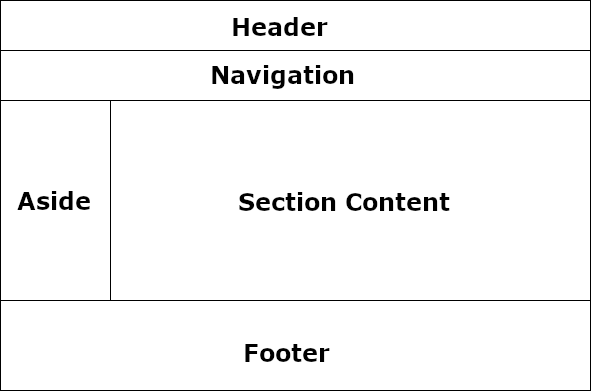
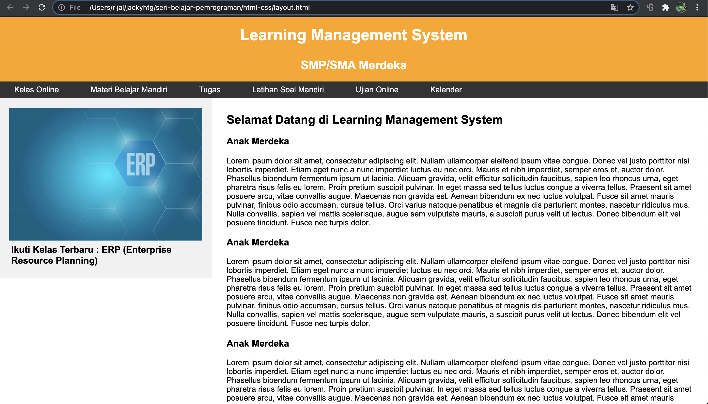
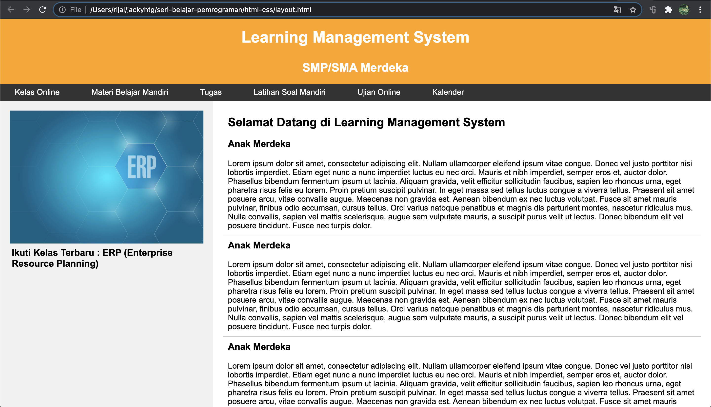
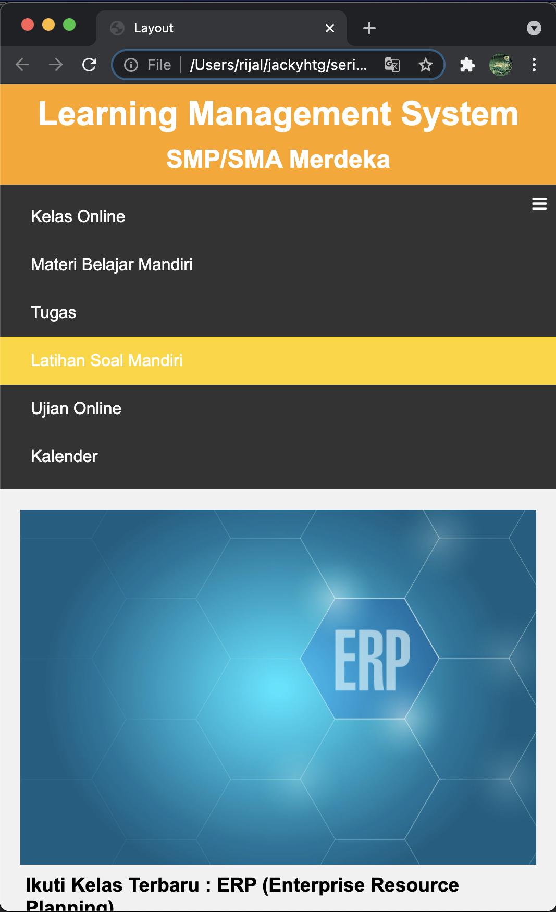

# Layout

Layout adalah desain tata letak,  suatu bentuk penataan desain dalam elemen tertentu yang telah ditata secara artistik, sehingga akan menarik & indah untuk dilihat dan digunakan.

Untuk layout, ada 4 teknik yang bisa digunakan, yaitu :

1. Table
2. Position \(table-less\)
3. Flexbox
4. Grid

Table digunakan untuk layout pada awal-awal teknologi web berkembang. Namun rendering table yang cukup lambat dan munculnya teknik position di css, menjadikan layout dengan table segera ditinggalkan.

Teknik position digunakan dalam layout karena dipandang lebih cepat performance-nya daripada tabel. Sementara tabel tetap digunakan secara alami ketika hendak menampilkan data-data dalam bentuk tabel. Aturan-aturan yang diterapkan terkait styling position yaitu :

* position : relative \| absolute
* float : left \| right
* clear: left \| right \| both
* top : x px
* bottom: x px
* left: x px
* right: x px

Karena tidak menggunakan table, teknik position juga dikenal dengan istilah table-less. Namun layouting dengan teknik position dianggap sangat rumit dan tidak memudahkan developer.

Dua teknik terbaru yang muncul dalam layout adalah flexbox dan grid. Kedua teknik ini sangat powerfull  jika dibandingkan dengan teknik position.

## Layout HTML

Dalam pembahaasan kali ini, kita akan membahas dua teknik layout, yaitu position dan flexbox. Baik position maupun flexbox akan menggunakan satu file html yang sama. File html ini disusun dengan menggunakan tag-tag layouting yang ramah terhadap search engine, seperti header, footer, nav, aside, dan section. 

Kita bisa saja menggunakan div \(dengan nama class header\), namun hal ini tidak mendatangkan benefit bagi search engine. Dengan tag layout, search engine akan mengenal mana informasi yang penting berdasarkan tag yang digunakan \(misal informasi yang ada di header, nav atau section\).

### Header

Bagian ujung depan yang digunakan di bagian atas halaman. Tag  &lt;header&gt; digunakan untuk menambahkan bagian header di halaman web. Informasi judul \(&lt;h1&gt; atau &lt;h2&gt;\) yang diletakkan di header dianggap penting oleh search engine. 

### Footer

Bagian footer berisi informasi kontak dan hal lain yang terkait dengan halaman web. Bagian footer selalu diletakkan di bagian bawah halaman web. Tag  &lt;footer&gt; digunakan untuk mengatur footer di halaman web.

### Section

Bagian konten adalah bagian utama tempat konten ditampilkan. Semua informasi dalam bentuk judul atau subjudul \(h1/h2/h3\), &lt;strong&gt;, &lt;em&gt;, dan hyperlink yang ada dalam bagian section akan dicrawl oleh search engine. Untuk membuat section gunakan tag &lt;section&gt;. 

### Aside

Aside merupan bagian tambahan yang menyimpan informasi atau iklan tambahan dan tidak selalu perlu ditambahkan ke halaman. Search engine tidak menganggap tag ini penting, sehingga jika ingin menampilkan informasi tambahan yang kurang penting \(tidak berkaitan dengan artikel dan keyword\), bisa ditampilkan dalam element aside. Gunakan tag &lt;aside&gt; untuk membuat elemen aside. 

### Nav

Nav merupakan bilah navigasi yang sama dengan daftar menu. Ini digunakan untuk menampilkan informasi konten menggunakan hyperlink.  Search engine akan mengcrawler tag  navigasi ini. Untuk membuat navigasi, gunakan tag &lt;nav&gt;.

Tampilan layout yang hendak dibuat dalam bab ini adalah seperti berikut :



Baiklah kita mulai, untuk mempraktekkan layout di html, buat file layout.html yang diisi dengan kode berikut:


```markup
<!DOCTYPE html>
<html>
  <head>
    <title>Layout</title>
  </head>
  <body>
    <header>
      <h1>Learning Management System</h1>
      <h2>SMP/SMA Merdeka</h2>
    </header>
    <nav>
      <ul>
        <li><a href="">Kelas Online</a></li>
        <li><a href="">Materi Belajar Mandiri</a></li>
        <li><a href="">Tugas</a></li>
        <li><a href="">Latihan Soal Mandiri</a></li>
        <li><a href="">Ujian Online</a></li>
        <li><a href="">Kalender</a></li>
      </ul>
    </nav>
    <div id="main-content">
      <aside>
        
        <h3>Ikuti Kelas Terbaru : ERP (Enterprise Resource Planning)</h3>
      </aside>
      <section>
        <h2>Selamat Datang di Learning Management System</h2>
        <article>
          <h3>Anak Merdeka</h3>
          <p>Lorem ipsum dolor sit amet, consectetur adipiscing elit. Nullam ullamcorper eleifend ipsum vitae congue. Donec vel justo porttitor nisi lobortis imperdiet. Etiam eget nunc a nunc imperdiet luctus eu nec orci. Mauris et nibh imperdiet, semper eros et, auctor dolor. Phasellus bibendum fermentum ipsum ut lacinia. Aliquam gravida, velit efficitur sollicitudin faucibus, sapien leo rhoncus urna, eget pharetra risus felis eu lorem. Proin pretium suscipit pulvinar. In eget massa sed tellus luctus congue a viverra tellus. Praesent sit amet posuere arcu, vitae convallis augue. Maecenas non gravida est. Aenean bibendum ex nec luctus volutpat. Fusce sit amet mauris pulvinar, finibus odio accumsan, cursus tellus. Orci varius natoque penatibus et magnis dis parturient montes, nascetur ridiculus mus. Nulla convallis, sapien vel mattis scelerisque, augue sem vulputate mauris, a suscipit purus velit ut lectus. Donec bibendum elit vel posuere tincidunt. Fusce nec turpis dolor.</p>
        </article>
        <article>
          <h3>Anak Merdeka</h3>
          <p>Lorem ipsum dolor sit amet, consectetur adipiscing elit. Nullam ullamcorper eleifend ipsum vitae congue. Donec vel justo porttitor nisi lobortis imperdiet. Etiam eget nunc a nunc imperdiet luctus eu nec orci. Mauris et nibh imperdiet, semper eros et, auctor dolor. Phasellus bibendum fermentum ipsum ut lacinia. Aliquam gravida, velit efficitur sollicitudin faucibus, sapien leo rhoncus urna, eget pharetra risus felis eu lorem. Proin pretium suscipit pulvinar. In eget massa sed tellus luctus congue a viverra tellus. Praesent sit amet posuere arcu, vitae convallis augue. Maecenas non gravida est. Aenean bibendum ex nec luctus volutpat. Fusce sit amet mauris pulvinar, finibus odio accumsan, cursus tellus. Orci varius natoque penatibus et magnis dis parturient montes, nascetur ridiculus mus. Nulla convallis, sapien vel mattis scelerisque, augue sem vulputate mauris, a suscipit purus velit ut lectus. Donec bibendum elit vel posuere tincidunt. Fusce nec turpis dolor.</p>
        </article>
        <article>
          <h3>Anak Merdeka</h3>
          <p>Lorem ipsum dolor sit amet, consectetur adipiscing elit. Nullam ullamcorper eleifend ipsum vitae congue. Donec vel justo porttitor nisi lobortis imperdiet. Etiam eget nunc a nunc imperdiet luctus eu nec orci. Mauris et nibh imperdiet, semper eros et, auctor dolor. Phasellus bibendum fermentum ipsum ut lacinia. Aliquam gravida, velit efficitur sollicitudin faucibus, sapien leo rhoncus urna, eget pharetra risus felis eu lorem. Proin pretium suscipit pulvinar. In eget massa sed tellus luctus congue a viverra tellus. Praesent sit amet posuere arcu, vitae convallis augue. Maecenas non gravida est. Aenean bibendum ex nec luctus volutpat. Fusce sit amet mauris pulvinar, finibus odio accumsan, cursus tellus. Orci varius natoque penatibus et magnis dis parturient montes, nascetur ridiculus mus. Nulla convallis, sapien vel mattis scelerisque, augue sem vulputate mauris, a suscipit purus velit ut lectus. Donec bibendum elit vel posuere tincidunt. Fusce nec turpis dolor.</p>
        </article>
      </section>
    </div>
    <footer>
      Copyright &copy; 2021
    </footer>
  </body>
</html>
```


## Layout CSS

Pertama kita akan membuat styling untuk tag-tag yang digunakan agar tampil lebih menarik secara visual. Buat file style.css dan tambahkan link css tersebut dalam head htrml.




```css
* {
  padding:0;
  margin:0;
}

body {
  font-family: Arial;
}

header{
  padding: 5px;
  text-align: center;
  background: orange;
  color: white;
}

nav {
  overflow: hidden;
  background-color: #333;
  padding:8px 0;
}

nav ul {
  list-style: none;
}

nav ul li {
  display: inline;
  padding: 14px 10px;
}

nav ul li a {
  color: white;
  padding: 14px 20px;
  text-decoration: none;
  text-align: center;
}

nav ul li a:hover {
  background-color: gold;
  color: black;
}

aside {
  background-color: #f1f1f1;
  padding: 20px;
}

aside img {
  width:100%;
}

section {
  background-color: white;
  padding: 20px;
}

article {
  border-bottom: 1px solid silver;
}

footer {
  padding: 20px;
  text-align: center;
  background: darkorange;
}

h1, h2, h3, p {
  padding: 1%;
}
```





```markup
<head>
    <title>Layout</title>
    <link rel="stylesheet" href="style.css"/>
</head>
```




### Position

Untuk kemudahan pembelajaran, styling layout saya pisahkan file-nya dengan nama table-less.css




```css
aside {
  float: left;
  width: calc(30% - 40px);
}

section {
  float: right;
  width: calc(70% - 40px);
}

footer {
  clear: both;
}
```





```markup
<head>
    <title>Layout</title>
    <link rel="stylesheet" href="style.css"/>
    <link rel="stylesheet" href="tableless.css"/>
  </head>
```




Halaman akan tampak seperti berikut : 



Jika diperhatikan, tinggi aside dan tinggi section tidaklah sama. Ini salah satu kelemahan layout dengan menggunakan teknik position, untuk mengakali hal ini, biasanya  dilakukan dengan smengatur tinggi aside secara dinamis mengikuti tinggi section menggunakan jacascript.

### Flex

Namun permasalahan di atas sangat mudah dipecahkan jika menggunakan teknik flex. Flex terdiri dari 2 komponen, flex container dan flex item. flex container merupakan induk, sementara flex item merupakan anak. 

Mengacu pada html yang sudah dibuat di atas, &lt;div id="main-content"&gt; adalah flex container \(induk\), sementara &lt;aside&gt; dan &lt;section&gt; adalah flex item  atau anak.

Role atau aturan css yang bisa disematkan di flex container/induk meliputi :

* display: flex \| inline-flex
* flex-direction: row \| row-reverse \| column \| column-reverse
* flex-wrap: nowrap \| wrap \| wrap-reverse 
* flex-flow: column wrap; shorthand untuk  `flex-direction` dan `flex-wrap`. Secara default, valuenya `row nowrap`.
* justify-content: flex-start \| flex-end \| center \| space-between \| space-around \| space-evenly \| start \| end \| left \| right ... + safe \| unsafe
* align-items: stretch \| flex-start \| flex-end \| center \| baseline \| first baseline \| last baseline \| start \| end \| self-start \| self-end + ... safe \| unsafe
* align-content: flex-start \| flex-end \| center \| space-between \| space-around \| space-evenly \| stretch \| start \| end \| baseline \| first baseline \| last baseline + ... safe \| unsafe

Sedangkan role atau aturan css yang bisa disematkan di flex item / anak meliputi :

* order: 5;  \(_default 0 \)_
* flex-grow: 4; \(_default 0 \)_
* flex-shrink: 3; \(_default 1, harus diisi angka positif \)_
* flex-basis: auto;
* flex: none \| \[ &lt;'flex-grow'&gt; &lt;'flex-shrink'&gt;? \|\| &lt;'flex-basis'&gt; \] } shorthand untuk kombinasi `flex-grow,` `flex-shrink` dan `flex-basis`. Paremeter kedua dan ketiga \(`flex-shrink` dan `flex-basis`\) adalah opsional. Secara default, valuenya `0 1 auto.`
* align-self: auto \| flex-start \| flex-end \| center \| baseline \| stretch;





```css
#main-content {
  display: flex;
  flex-wrap: wrap;
}

aside {
  flex: calc(30% - 40px);
}

section {
  flex: calc(70% - 40px);
}
```





```
<head>
    <title>Layout</title>
    <link rel="stylesheet" href="style.css"/>
    <link rel="stylesheet" href="flex.css"/>
</head>
```




Dengan teknik flex, akan menghasilkan tinggi yang selaras antara aside dan section. 



Untuk belajar lebih jauh tentang flex, saya rekomendasikan untuk membaca [a Complete Guide to Flexbox ](https://css-tricks.com/snippets/css/a-guide-to-flexbox/).

### Responsive Layout

Seiring munculnya berbagai device, developer dituntut untuk menghasilkan layout yang baik ketika dijalankan di semua device. Teknik media query adalah salah satu teknik yang mesti diterapkan jika ingin mengimplementasikan responsive web design.

Kali ini kita akan membuat design layout flex di atas menjadi responsive. Ada 2 hal penting untuk menjadi responsif :

1. ketika ukuran hp \(&lt;= 600px\), maka \#main-content akan berubah menjadi kolom. 
2. ketika ukuran hp \(&lt;= 600px\), maka menu akan berubah menjadi dropdown dengan togle show/hide. 

Untuk deteksi ukuran screen, kita memanfaatkan media query.  Sementara untuk poin pertama, kita bisa memanfaatkan flex-direction : column \| column-reverse.


```css
@media screen and (max-width: 600px) {
  #main-content {
    flex-direction: column;
  }
}
```


Untuk poin kedua, langkah yang dilakukan relatif lebih panjang :

1. Tambahkan hyperlink burger menu yang secara default tersembunyi.
2. Jika ukuran &lt;= 600, sembunyikan menu, dan tampilkan burger menu.
3. Jika burger menu diklik, akan menambahkan togle class responsive pada navigasi menu. Ini dilakukan dengan membuat fungsi javascript onClick.
4. Jika ukuran layar &lt;= 600, navigasi menu akan dibuat menjadi list tersusun ke bawah.
5. jika ukuran layar &lt;= 600, navigasi dibuatkan 2 style, yang tanpa class responsif akan tersembunyi. Dan satu style lagi dengan class responsif dimana menu akan ditampilkan.

Pada file layout.html dan flex.css yang sudah ada, tambahkan/sisipikan kode berikut :




```css
<link rel="stylesheet" href="https://cdnjs.cloudflare.com/ajax/libs/font-awesome/4.7.0/css/font-awesome.min.css">

<nav class="navigation">
  <a href="javascript:void(0);" class="icon" onclick="myFunction()"><i class="fa fa-bars"></i></a>
  <ul>
    <li><a href="">Kelas Online</a></li>
    <li><a href="">Materi Belajar Mandiri</a></li>
    <li><a href="">Tugas</a></li>
    <li><a href="">Latihan Soal Mandiri</a></li>
    <li><a href="">Ujian Online</a></li>
    <li><a href="">Kalender</a></li>
  </ul>
</nav>

<script>
  function myFunction() {
    var x = document.getElementsByTagName("nav")[0];
    if (x.className === "navigation") {
      x.className += " responsive";
    } else {
      x.className = "navigation";
    }
  }
</script>
```





```css
.navigation .icon {
  display: none;
}

@media screen and (max-width: 600px) {
  #main-content {
    flex-direction: column;
  }

  .navigation {
    position:relative;
    min-height: 20px;
  }

  .navigation .icon {
    display:block;
    position: absolute;
    top:10px;
    right:10px;
    color:white;
  }

  .navigation ul {
    display:none;
  }

  .navigation ul li {
    display: block;
  }

  .navigation ul li:hover {
    background: gold;
  }

  .navigation.responsive ul {
    display: block;
  }

}
```




Begini tampilan halaman ketika dibuka di device dengan layar &lt;= 600 px.



Materi layout halaman HTML sudah selese. Jika Anda ingin mempelajari teknik layout yang lain seperti grid, saya sarankan untuk membaca [A Complete Guide to Grid](https://css-tricks.com/snippets/css/complete-guide-grid/). Namun anda juga bisa mengabaikan-nya untuk saat ini \(bisa belajar grid di lain waktu\) dan beralih ke materi selanjutnya. 

