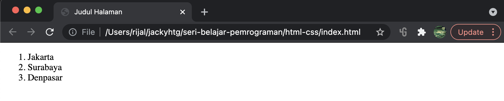
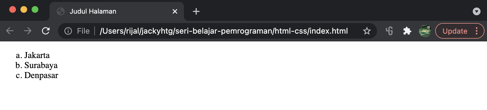
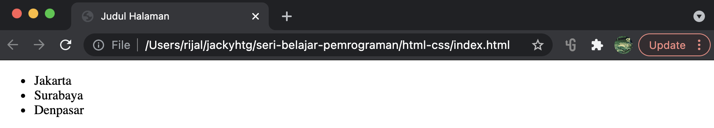
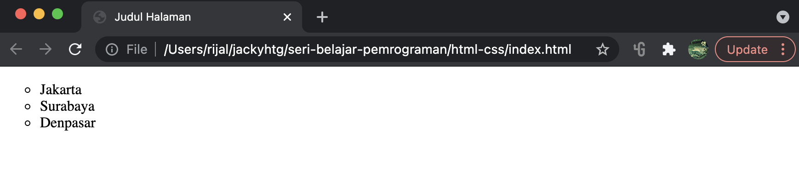

# List

Elemen list digunakan untuk membuat suatu list atau daftar. HTML menyediakan dua jenis list, yaitu _ordered list_ \(list berurutan\) dan _unordered list_ \(list tidak berurutan\). Setelah elemen list dibuat, kita bisa mengisinya dengan _list item_ sebanyak yang diinginkan. Tag &lt;li&gt; digunakan untuk membuat _list item_.

### List Berurutan

Tag &lt;ol&gt; atau _ordered list_ digunakan untuk membuat list yang berurutan.

```markup
<ol>
    <li>Jakarta</li>
    <li>Surabaya</li>
    <li>Denpasar</li>
</ol>
```



Secara default urutan list ditentukan dengan angka. Jika ingin mengubah jenis urutan, kita bisa memanfaatkan aturan-aturan pada css, yaitu : **list-style-type**.

```markup
<style>
    ol {
        list-style-type: lower-latin;
    } 
</style>
<ol>
    <li>Jakarta</li>
    <li>Surabaya</li>
    <li>Denpasar</li>
</ol>
```



Ada banyak tipe list-style, saya akan menuliskan beberapa yang sering digunakan, yaitu : decimal-leading-zero, lower-latin, lower-roman, upper-latin, dan upper-roman.

### List Tidak Berurutan

Tag &lt;ul&gt; atau _unordered list_ digunakan untuk membuat list yang tidak berurutan.

```markup
<ul>
    <li>Jakarta</li>
    <li>Surabaya</li>
    <li>Denpasar</li>
</ul>
```



Secara default urutan list ditentukan dengan _**disc**_. Jika ingin mengubah tipe list, kita bisa memanfaatkan aturan-aturan pada css, yaitu : **list-style-type**.

```markup
<style>
    ul {
        list-style-type: circle;
    }
</style>

<ul>
    <li>Jakarta</li>
    <li>Surabaya</li>
    <li>Denpasar</li>
</ul>
```



Tipe list-style untuk _unordered list_ yang sering digunakan adalah: circle, square, dan none.

