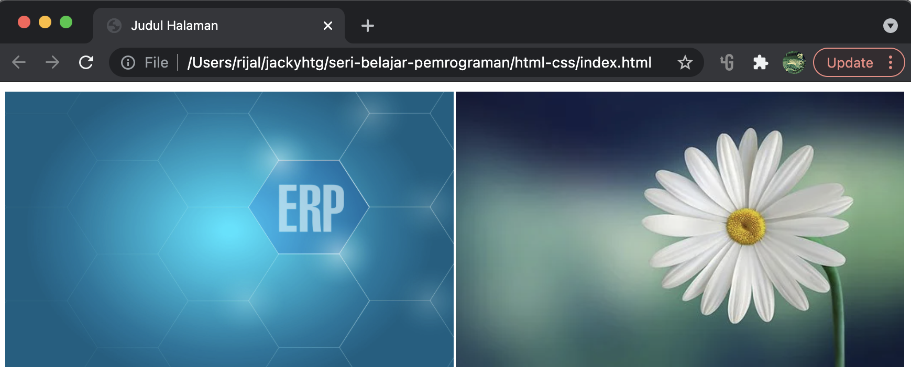
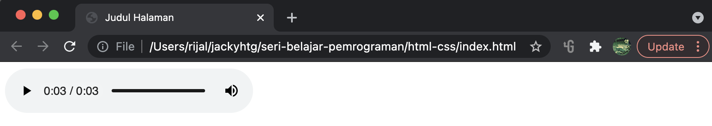
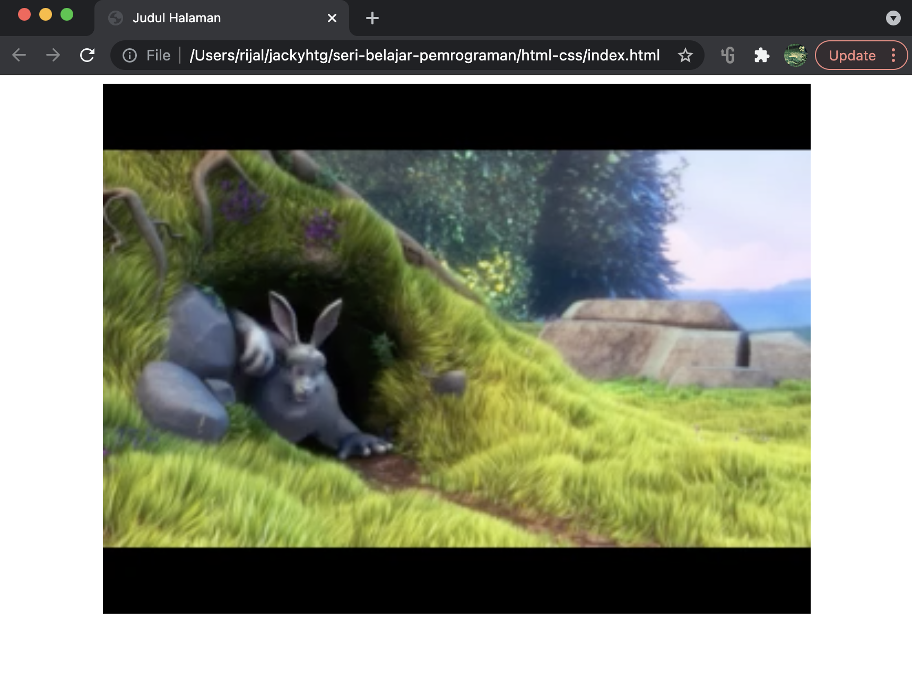
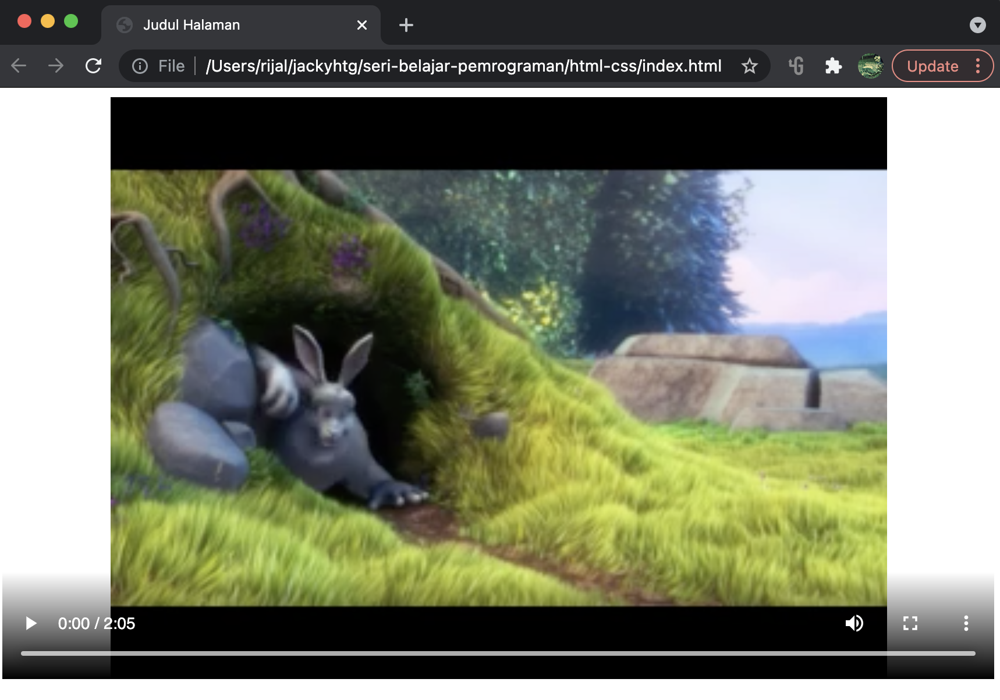

# Link, Gambar dan Multimedia

## Link

Untuk membuat link dari satu halaman ke halaman lain, gunakan hyperlink dengan tag &lt;a&gt;

```markup
<ul>
    <li><a href="judul.html">Judul</a></li>
    <li><a href="paragraf.html">Paragraf</a></li>
    <li><a href="font-size.html">Font Size</a></li>
    <li><a href="color.html">Warna</a></li>
</ul>

<p>Dalam HTML, <a href="list.html">list</a> sering kali digunakan untuk menampilkan daftar suatu benda. <a href="list.html">List</a> juga sering digunakan dalam membuat menu dalam layout HTML</p>
```

## Gambar

Gunakan tag &lt;img/&gt; untuk menampilkan file gambar. Atribut utama &lt;img/&gt; adalah src dan alt. src diisi dengan source file gambar \(bisa berupa url maupun path direktori file\), sementara alt adalah alternatif teks yang ditampilkan jika source gambar tidak berhasil dimuat. Sebenarnya ada atribut lain width dan height juga, tapi saya pribadi lebih suka memasang width dan height di dalam style, untuk mencegah atribut width dan height gambar sudah dipasang sebagai atribut gambar namun ternyata tidak berlaku karena di-override oleh css.

```markup
<style>
  div {
    width:100%;
  }

  img {
    height:30vw;
    width: calc(50% - 2px);
    float:left;
    border: 1px solid white;
  }
</style>
<div>
  
  
</div>
```

* Div digunakan untuk mengelompokkan semua gambar dalam 1 group element.
* Tinggi gambar dibuat responsif dengan ukuran vw
* Float digunakan untuk membuat gambar menjadi floating \(defaultnya adalah block\) sehingga bisa ditampilkan secara berdampingan.
* Border digunakan agar ada jarak antara 2 gambar.
* Lebar sebenarnya dibuat 50%, namun karena ada border 1px di masing-masing gambar maka pengaturan lebar menjadi 50% - \(2gambar x 1 pixel\). CSS menyediakan penghitungan seperti ini melalui calc. sehingga width : calc\(50% - 2px\).  

File html di atas jika dibuka di browser akan tampil seperti gambar di bawah ini. Jika browser diubah-ubah lebar dan tinggi-nya, tampilan gambar akan responsif mengikuti perubahan lebar dan tinggi browser.



File format gambar yang didukung oleh html meliputi :

| Abbreviation | File Format | File Extension |
| :--- | :--- | :--- |
| APNG | Animated Portable Network Graphics | .apng |
| GIF | Graphics Interchange Format | .gif |
| ICO | Microsoft Icon | .ico, .cur |
| JPEG | Joint Photographic Expert Group image | .jpg, .jpeg, .jfif, .pjpeg, .pjp |
| PNG | Portable Network Graphics | .png |
| SVG | Scalable Vector Graphics | .svg |

## Multimedia

Multimedia di web adalah suara, musik, video, film, dan animasi. Multimedia hadir dalam berbagai format. Namun tidak semua didukung oleh HTML, hanya sebagian kecil format multimedia yang didukung oleh broser.

### Audio

HTML hanya mendukung 3 format audio, yaitu: MP3, WAV dan Ogg. Selain itu, HTML juga mendukung file MP4, yang sebenarnya adalah format untuk video, namun bisa juga digunakan untuk audio.

| Format | File | Description |
| :--- | :--- | :--- |
| WAV | .wav | WAV. Developed by IBM and Microsoft. Plays well on Windows, Macintosh, and Linux operating systems. |
| Ogg | .ogg | Ogg. Developed by the Xiph.Org Foundation. |
| MP3 | .mp3 | MP3 files are actually the sound part of MPEG files. MP3 is the most popular format for music players. Combines good compression \(small files\) with high quality.  |
| MP4 | .mp4 | MP4 is a video format, but can also be used for audio. |

Untuk menampilkan audio, gunakan element &lt;audio&gt;

```markup
<audio controls>
  <source src="sample-3s.mp3" type="audio/mpeg">
  Your browser does not support the audio element.
</audio>
```



### Video

HTML mendukung tiga format file multimedia, meliputi .ogg, .webm dan .mp4

| Format | File | Description |
| :--- | :--- | :--- |
| Ogg | .ogg | Theora Ogg. Developed by the Xiph.Org Foundation. |
| WebM | .webm | WebM. Developed by Mozilla, Opera, Adobe, and Google. |
| MPEG-4 or MP4 | .mp4 | MP4. Developed by the Moving Pictures Expert Group. Commonly used in video cameras and TV hardware. |

Untuk menampilkan video, gunakan element &lt;video&gt;

```markup
<video width="100%" height="500vw">
  <source src="sample-mp4-file.mp4" type="video/mp4">
  Your browser does not support the video tag.
</video>
```



Tampilan di browser tampak seperti gambar saja, ini dikarenakan di kode di atas tidak mengaktifkan controls. Tambahkan atribut controls seperti kode berikut :

```markup
<video width="100%" height="500vw" controls>
  <source src="sample-mp4-file.mp4" type="video/mp4">
  Your browser does not support the video tag.
</video>
```



Sekarang video bisa diputar, di-pause, diatur volumenya, fullscreen dan sebagianya. Kita bisa menambahkan autoplay agar ketika halaman dibuka, video langsung play. Namun browser keluarga chromimum \(chromium, chrome, safari, microsoft edge\) tidak mendukung autoplay. Browser keluarga chromium hanya mendukung autoplay jika dikombinasikan dengan atribut muted.

```markup
<video width="100%" height="500vw" controls autoplay muted>
  <source src="sample-mp4-file.mp4" type="video/mp4">
  Your browser does not support the video tag.
</video>
```

