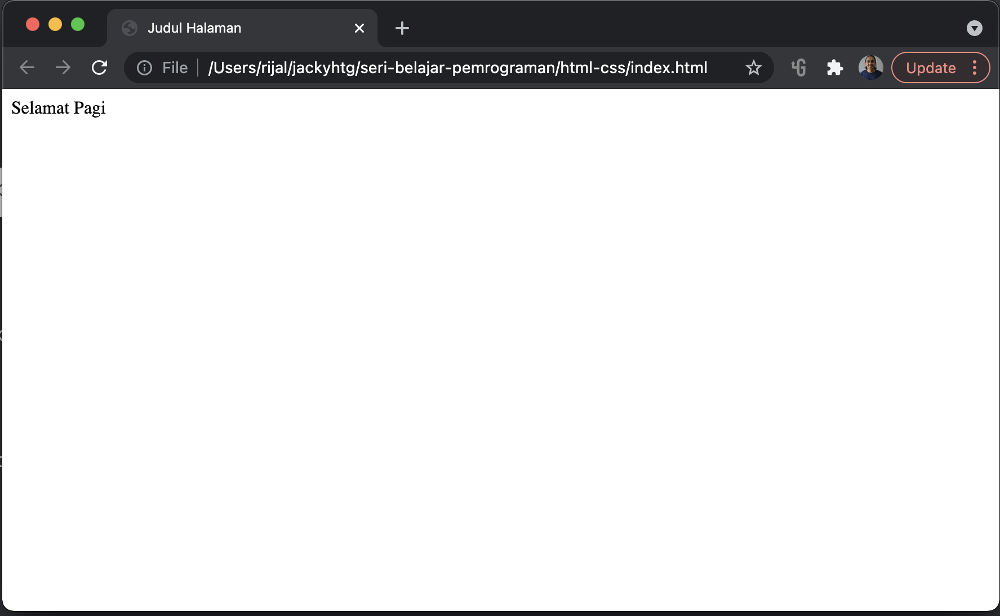

# Pengenalan HTML dan CSS

## HTML

HTML adalah bahasa markup standar untuk membuat halaman Web yang menggambarkan struktur halaman Web. Berikut struktur dasar HTML :

```markup
<!DOCTYPE html>
<html>
    <head>
        <title>Judul Halaman</title>
    </head>
    <body>
        Selamat Pagi
    </body>
</html>
```

* Deklarasi &lt;!DOCTYPE html&gt; mendefinisikan bahwa dokumen ini adalah dokumen HTML5
* Elemen  &lt;html&gt; adalah elemen root dari halaman HTML
* Elemen  &lt;head&gt; berisi informasi meta tentang halaman HTML
* Elemen  &lt;title&gt; menentukan judul untuk halaman HTML \(yang ditampilkan di judul browser atau tab halaman\) 
* Elemen  &lt;body&gt; mendefinisikan tubuh dokumen, dan merupakan wadah untuk semua konten yang terlihat, seperti teks, judul, paragraf, gambar, hyperlink, tabel dll.

### Text Editor

Untuk membuat/mengedit file html bisa dilakukan dengan text editor sederhana seperti notepad, maupun text editor yang dibangun khusus untuk developer. Saya pribadi biasa menggunakan visual code. Download Viusak code melalui halaman [https://code.visualstudio.com/download](https://code.visualstudio.com/download) dan install di komputer/laptop.

File html disimpan dengan ekstensi .html. Buka visual code dan buat file index.html yang berisi dengan kode html seperti di atas. File ini ketika dibuka dengan browser \(seperti chrome/firefox/opera\) akan menampilkan tulisan "Selamat Pagi". Silahkan coba klik file index.html yang telah dibuat,  tampilan di browser akan tampak seperti gambar di bawah ini.



### Tag

Sebagai sebuah bahasa markup, **HTML** membutuhkan cara untuk memberitahu web browser untuk apa fungsi sebuah text. Apakah text itu ditulis sebagai sebuah paragraf, list, atau sebagai link. Dalam **HTML**, tanda ini dikenal dengan istilah **tag**.

Tag dimulai dengan simbol lebih kecil \(&lt;\) dan ditutup dengan simbol lebih besar \(&gt;\). Perhatikan beberapa contoh berikut :

* &lt;p&gt; adalah tag untuk paragraf
* &lt;h1&gt; adalah tag untuk judul utama

Tag dibagi dua jenis, yaitu tag buka dan tag tutup. Yang membedakan suatu tag buka dengan tag tutup adalah simbol slash \(/\). Jika ada simbol slash \(/\) berarti merupakan tag tutup. Untuk tag paragraf, &lt;p&gt; adalah tag buka. Sementara tag tutupnya adalah &lt;/p&gt;. 

### Element

Element HTML adalah semua yang dimulai dari TAG buka sampai TAG tutup. Jadi di antara tag buka dengan tag tutup ada suatu _content_ berupa text. keseluruhan tag beserta isinya itulah yang disebut element.

Berikut adalah contoh suatu elemen berupa paragraf :

```markup
<p>Selamat pagi Indonesia, semoga semua sehat...</p> 
```

Tidak semua tag memiliki isi, tag br yang berfungsi sebagai ganti baris \(line break\) tidak membutuhkan isi. Tag input juga tidak memerlukan isi. Untuk semua tag yang tidak memerlukan isi, tag tersebut setelah dibuka bisa langsung ditutup. Berikut contoh tag yang langsung ditutup karena tidak memerlukan isi.

* &lt;br/&gt;  
* &lt;input /&gt;
* &lt;button/&gt;

### Attributes

_Attribute_ adalah informasi tambahan dari sebuah _element_. Atribut ini tidak wajib, hanya opsional, dan diletakkan di tag awal. Cara penulisan atribut adalah dengan menuliskan nama atribut dan nilai dari atribut. Contoh penulisan atribut sebagai berikut :

```markup
<p style="color:green">Selamat Pagi</p>

```

Kode di atas terdiri dari dua elemen, yaitu elemen paragraf dan elemen gambar. Pada elemen paragraf, terdapat satu atribut, yaitu atribut style dengan nilai color:green. Sementara pada elemen gambar terdapat 4 atribut, meliputi src, width, height, dan alt. Lebih jauh tentang elemen paragraf dan elemen gambar, akan dibahas pada bab selanjutnya. 

## CSS

CSS digunakan untuk menata tampilan halaman web, kertas atau media lain. Dengan CSS tampilan HTML menjadi lebih cantik, artistik dan mudah terbaca. Beberapa poin penting pengertian CSS meliputi : 

* CSS adalah bahasa yang digunakan untuk menata halaman Web
* CSS adalah singkatan dari _Cascading Style Sheets_
* CSS menjelaskan bagaimana elemen HTML ditampilkan di layar, kertas, atau di media lain

Pembahasan CSS akan dilakukan bertahap dengan menyisipkan pada materi html yang berkaitan \(_related_\).

