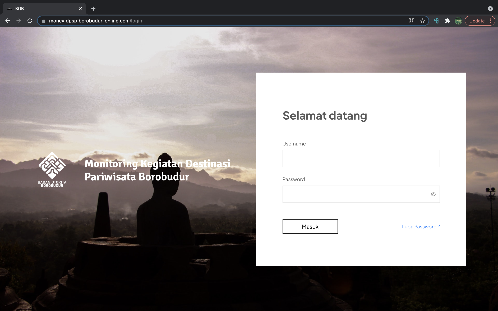
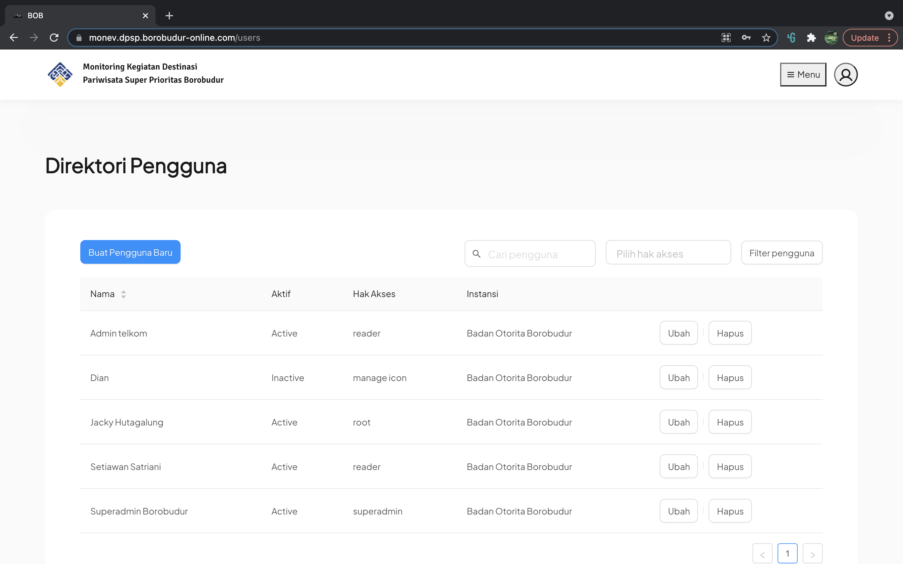

# Praktikum : Membuat Halaman Login dan CRUD

Kerjakan tugas praktikum sebagai berikut :

1. Buat halaman login.
2. Buat halaman list user yang diserta tombol "create new user" di bagian atas. Di setiap row juga disertakan link untuk view, edit dan delete. Jika link delete di-klik tampilkan dialog konfirmasi, "Yakin hendak menghapus data user?".
3.  Buat halaman form input user baru.
4. Buat halaman form update user.

Design bebas sesuai dengan kreativitas masing-masing, sebagai contoh, berikut saya lampirkan tampilan login dan Halaman CRUD.

