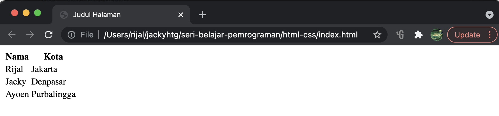
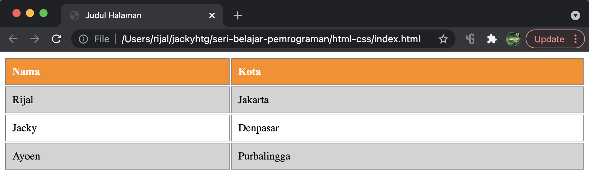
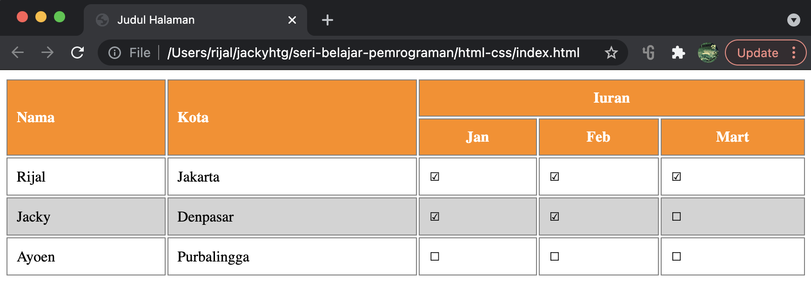

# Tabel

## Table, Baris dan Kolom

* Element &lt;table&gt; untuk membuat tabel
* Elemen &lt;tr&gt; atau _table row_ untuk membuat baris
* Elemen &lt;th&gt; atau _table header_ untuk membuat kolom header
* Elemen &lt;td&gt; atau _table data_ untuk membuat kolom

```markup
<table>
    <tr>
        <th>Nama</th>
        <th>Kota</th>
    </tr>
    <tr>
        <td>Rijal</td>
        <td>Jakarta</td>
    </tr>
    <tr>
        <td>Jacky</td>
        <td>Denpasar</td>
    </tr>
    <tr>
        <td>Ayoen</td>
        <td>Purbalingga</td>
    </tr>
</table>
```



Kita bisa menggunakan css untuk mempercantik tampilan tabel.

```markup
<style>
    table {
      width:100%;
    }

    table td, table th {
      border: 1px solid grey;
      padding: 10px;
    }

    table th {
      background-color: darkorange;
      text-align: left;
      color: white;
    }

    table tr:nth-child(even){
      background-color: lightgray;
    }
    
    table tr:hover {
      background-color:gray;
    }
</style>
<table>
    <tr>
        <th>Nama</th>
        <th>Kota</th>
    </tr>
    <tr>
        <td>Rijal</td>
        <td>Jakarta</td>
    </tr>
    <tr>
        <td>Jacky</td>
        <td>Denpasar</td>
    </tr>
    <tr>
        <td>Ayoen</td>
        <td>Purbalingga</td>
    </tr>
</table>
```



## Merge Baris dan Merge Kolom

Untuk menggabungkan 2 baris menjadi 1, gunakan atribut _**rowspan**_. Sementara untuk menggabungkan 2 kolom menjadi satu, gunakan atribut _**colspan**_.

```markup
<style>
  table {
    width:100%;
  }
  
  table td, table th {
    border: 1px solid grey;
    padding: 10px;
  }
  
  table th {
    background-color: darkorange;
    text-align: left;
    color: white;
  }
  
  table th.alignCenter {
    text-align: center;
  }
  
  table tr:nth-child(even){
    background-color: lightgray;
  }
  
  table tr:hover {
    background-color:gray;
  }
</style>
<table>
  <tr>
    <th rowspan="2">Nama</th>
    <th rowspan="2">Kota</th>
    <th colspan="3" class="alignCenter">Iuran</th>
  </tr>
  <tr>
    <th class="alignCenter">Jan</th>
    <th class="alignCenter">Feb</th>
    <th class="alignCenter">Mart</th>
  </tr>
  <tr>
    <td>Rijal</td>
    <td>Jakarta</td>
    <td>&#9745;</td>
    <td>&#9745;</td>
    <td>&#9745;</td>
  </tr>
  <tr>
    <td>Jacky</td>
    <td>Denpasar</td>
    <td>&#9745;</td>
    <td>&#9745;</td>
    <td>&#9744;</td>
  </tr>
  <tr>
    <td>Ayoen</td>
    <td>Purbalingga</td>
    <td>&#9744;</td>
    <td>&#9744;</td>
    <td>&#9744;</td>
  </tr>
</table>
```



