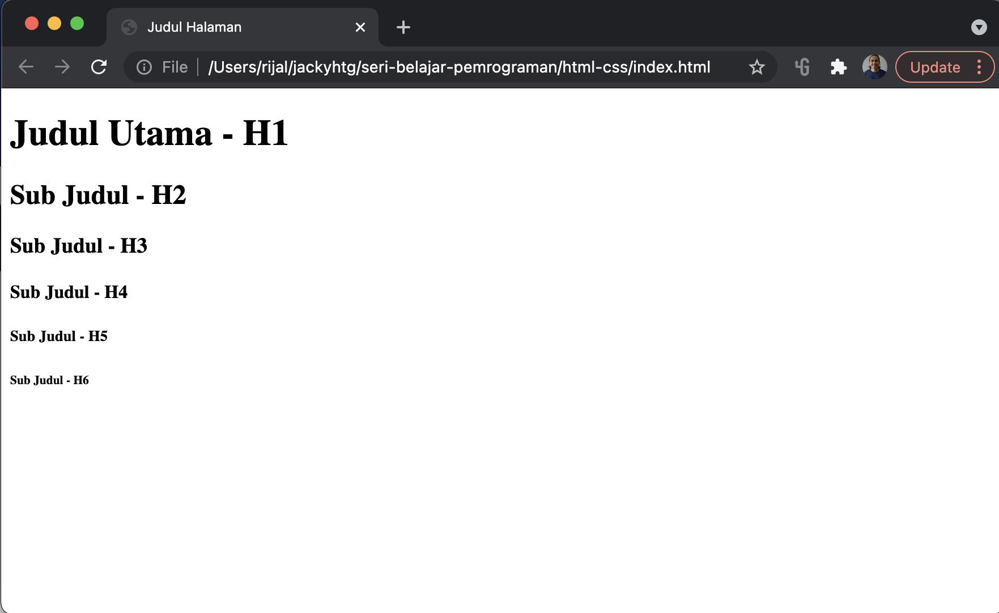
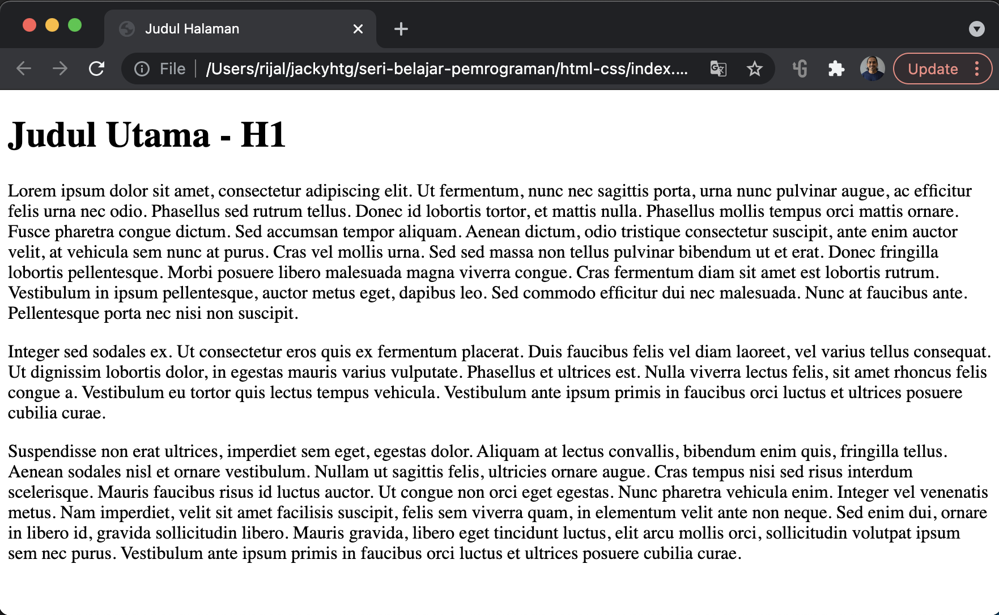
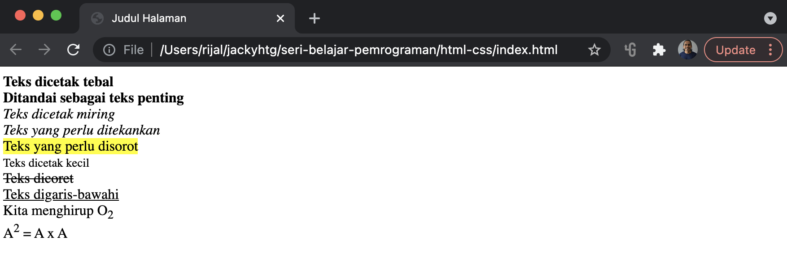
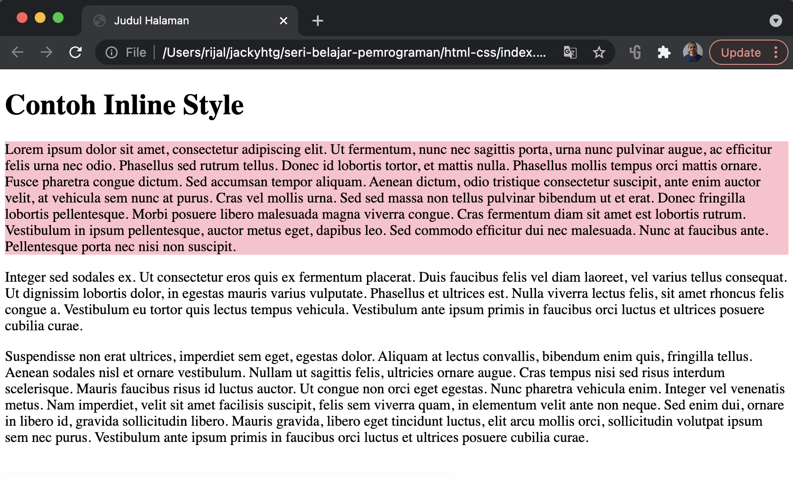
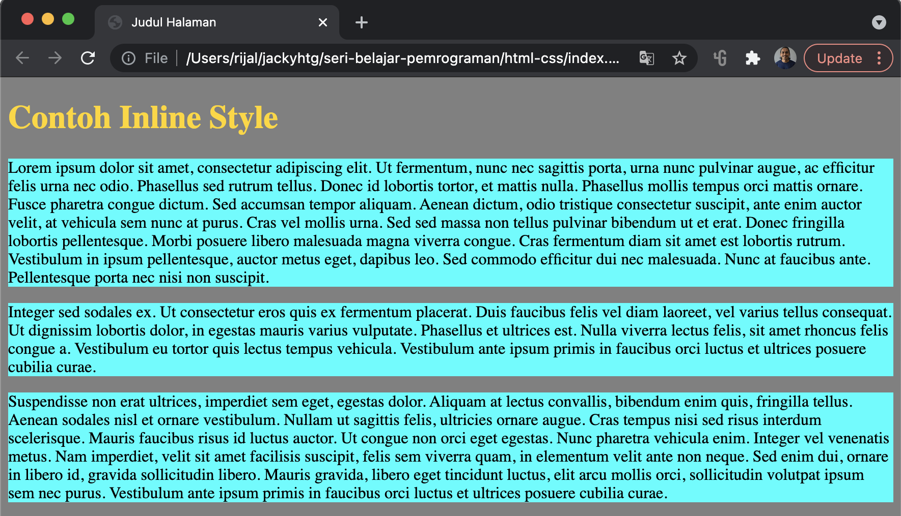
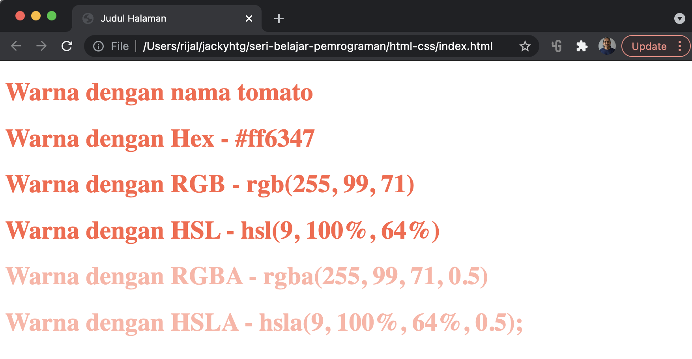
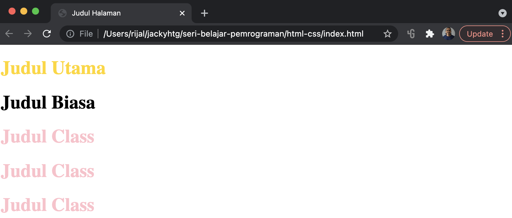

# Tipografi Dasar

Tipografi adalah suatu teknik dalam memilih dan menata huruf dengan indah dalam suatu ruang yang tersedia. Ini melibatkan pilihan jenis huruf, ukuran huruf, warna, format teks yang disusun sedemikian rupa sehingga tampilan menjadi mudah dibaca.

Pada bab ini siswa akan mempelajari elemen elemen terkait tipografi, dan styling untuk mempercantik tampilan.

## Judul

Untuk membuat judul atau sub judul, kita menggunakan tag h \(heading\). Disediakan 6 jenis heading, dari judul utama sampai ke sub judul yang paling kecil. 

Judul ini sangat penting dalam sebuah halaman web. Search engine seperti google, bing, yahoo, yandex dll, memanfaatkan judul untuk algoritma pencarian mereka. Gunakan judul sesuai dengan fungsinya secara alami. Dalam suatu artikel hanya boleh ada satu judul utama. Di dalam artikel bisa terdiri dari beberapa sub judul. 

Jangan menggunakan judul untuk alasan artistik agar suatu teks kelihatan besar dan atau tebal. Karena untuk artistik kita bisa memanfaatkan styling \(CSS\) untuk mengatur besaran dan tampilan huruf. Letakkan judul pada porsinya secara alamiah.

Berikut cara penulisan judul/sub judul, mulai dari judul utama \(h1\) sampai sub judul yang paling kecil \(h6\).

```markup
<h1>Judul Utama - H1</h1>
<h2>Sub Judul - H2</h2>
<h3>Sub Judul - H3</h3>
<h4>Sub Judul - H4</h4>
<h5>Sub Judul - H5</h5>
<h6>Sub Judul - H6</h6>
```



Saya pribadi biasanya hanya menggunakan tiga jenis judul/sub judul, yaitu H1, H2 dan H3. Satu artikel hanya mempunyai H1 sebagai judul utama. Di dalam body artikel bisa mempunyai 2 sampai 4 sub judul H2. Dan di masing-masing sub judul H2, bisa mempunyai beberapa sub judul lagi berupa H3.

## Paragraf

Paragraf digunakan untuk membuat suatu alinea/paragraf dalam suatu tulisan. Tag &lt;p&gt; digunakan untuk membuat suatu paragraf. Paragraf  selalu dimulai pada baris baru, dan biasanya berupa blok teks. Browser secara otomatis menambahkan beberapa spasi \(margin\) sebelum dan sesudah paragraf.

```markup
<p>Lorem ipsum dolor sit amet, consectetur adipiscing elit. Ut fermentum, nunc nec sagittis porta, urna nunc pulvinar augue, ac efficitur felis urna nec odio. Phasellus sed rutrum tellus. Donec id lobortis tortor, et mattis nulla. Phasellus mollis tempus orci mattis ornare. Fusce pharetra congue dictum. Sed accumsan tempor aliquam. Aenean dictum, odio tristique consectetur suscipit, ante enim auctor velit, at vehicula sem nunc at purus. Cras vel mollis urna. Sed sed massa non tellus pulvinar bibendum ut et erat. Donec fringilla lobortis pellentesque. Morbi posuere libero malesuada magna viverra congue. Cras fermentum diam sit amet est lobortis rutrum. Vestibulum in ipsum pellentesque, auctor metus eget, dapibus leo. Sed commodo efficitur dui nec malesuada. Nunc at faucibus ante. Pellentesque porta nec nisi non suscipit.</p>
<p>Integer sed sodales ex. Ut consectetur eros quis ex fermentum placerat. Duis faucibus felis vel diam laoreet, vel varius tellus consequat. Ut dignissim lobortis dolor, in egestas mauris varius vulputate. Phasellus et ultrices est. Nulla viverra lectus felis, sit amet rhoncus felis congue a. Vestibulum eu tortor quis lectus tempus vehicula. Vestibulum ante ipsum primis in faucibus orci luctus et ultrices posuere cubilia curae.</p>
<p>Suspendisse non erat ultrices, imperdiet sem eget, egestas dolor. Aliquam at lectus convallis, bibendum enim quis, fringilla tellus. Aenean sodales nisl et ornare vestibulum. Nullam ut sagittis felis, ultricies ornare augue. Cras tempus nisi sed risus interdum scelerisque. Mauris faucibus risus id luctus auctor. Ut congue non orci eget egestas. Nunc pharetra vehicula enim. Integer vel venenatis metus. Nam imperdiet, velit sit amet facilisis suscipit, felis sem viverra quam, in elementum velit ante non neque. Sed enim dui, ornare in libero id, gravida sollicitudin libero. Mauris gravida, libero eget tincidunt luctus, elit arcu mollis orci, sollicitudin volutpat ipsum sem nec purus. Vestibulum ante ipsum primis in faucibus orci luctus et ultrices posuere cubilia curae.</p>
```



## Format

Format diperlukan ketika ingin mendefinisikan teks dengan arti khusus, misalnya cetak tebal, cetak miring dan lain-lain.

Elemen pemformatan dirancang untuk menampilkan jenis teks khusus:

* `<b>` - Bold text - cetak tebal
* `<strong>` - Important text - kata penting
* `<i>` - Italic text - cetak miring
* `<em>` - Emphasized text - teks ditekankan
* `<mark>` - Marked text - teks disorot
* `<small>` - Smaller text - teks dicetak dengan ukuran kecil
* `<del>` - Deleted text - teks dicoret
* `<ins>` - Inserted text - teks digarisbawahi
* `<sub>` - Subscript text - teks dicetak menjorok ke bawah
* `<sup>` - Superscript text - teks dicetak menjorok ke atas

```markup
<b>Teks dicetak tebal</b> <br/>
<strong>Ditandai sebagai teks penting</strong> <br/>
<i>Teks dicetak miring</i> <br/>
<em>Teks yang perlu ditekankan</em> <br/>
<mark>Teks yang perlu disorot</mark> <br/>
<small>Teks dicetak kecil</small> <br/>
<del>Teks dicoret</del> <br/>
<ins>Teks digaris-bawahi</ins> <br/>
Kita menghirup O<sub>2</sub> <br/>
A<sup>2</sup> = A x A 
```



Yang perlu diperhatikan adalah perbedaan antara &lt;b&gt; dan &lt;strong&gt;, serta &lt;i&gt; dengan &lt;em&gt;. Secara tampilan, &lt;b&gt; dan &lt;strong&gt; tampak sama-sama dicetak tebal, tapi sebenarnya fungsi-nya berbeda. &lt;b&gt; adalah bold yang hanya mencetak tulisan secara tebal. Tapi &lt;strong&gt; artinya adalah kata yang penting. Search engine tidak akan mengindeks kata yang dicetak tebal, tapi akan mengindeks kata yang penting. Kita bisa saja boros menggunakan &lt;b&gt; untuk mencetak kata menjadi tebal. Namun kalau kita menandai sembarang kata \(banyak kata\) sebagai kata penting, search engine akan malas mengindeks halaman web kita. Kalau kita menandai banyak sekali kata sebagai kata penting, artinya semua kata itu menjadi tidak penting khan? Jadi bijaklah menggunakan &lt;strong&gt; hanya untuk menandai teks yang benar-benar penting.

Begitu juga dengan &lt;i&gt; dan &lt;em&gt; yang secara tampilan sama-sama dicetak miring, tapi mempunyai fungsi yang berbeda. &lt;i&gt; artinya italic hanya untuk mencetak teks secara miring. tag &lt;i&gt; bisa digunakan berkali-kali tanpa ada pengaruh terhadap search engine. Namun berbeda dengan &lt;em&gt; yang artinya emphasized atau penekanan. Jadi teks yang ditandai dengan tag &lt;em&gt; hanyalah teks yang memang perlu ditekankan. Search engine akan meng-_crawler_ teks yang ditandai dengan &lt;em&gt;. Jadi bijaklah menggunakan tag &lt;em&gt;, gunakan hanya jika kita memandang teks tersebut perlu untuk ditekankan.

## Style

Seperti yang telah disinggung di pengenalan CSS, style digunakan untuk mempercantik tampilan. Ada 3 cara bagaimana kita memberi style pada tag html, yaitu : Inline CSS, Internal CSS, dan eksternal CSS.

### Inline CSS

Inline CSS artinya kita memberi style secara inline pada tag html. Keunggulan-nya adalah ketika elemen tersebut di-load otomatis juga sudah terbawa styling-nya. Inline CSS juga berguna jika kita ingin memberi style hanya khusus pada satu tag yang dinginkan. Styling yang disematkan secara inline di tag tersebut, tidak akan berdampak pada tag di tempat lain, walaupun kedua tag tersebut sama \(misalnya &lt;p&gt; pertama diberi inline style, dan &lt;p&gt; yang berikutnya tidak, maka style hanya bekerja pada &lt;p&gt; pertama saja\).

Perhatikan contoh berikut :

```markup
<h1>Contoh Inline Style</h1>
<p style="background-color:pink">Lorem ipsum dolor sit amet, consectetur adipiscing elit. Ut fermentum, nunc nec sagittis porta, urna nunc pulvinar augue, ac efficitur felis urna nec odio. Phasellus sed rutrum tellus. Donec id lobortis tortor, et mattis nulla. Phasellus mollis tempus orci mattis ornare. Fusce pharetra congue dictum. Sed accumsan tempor aliquam. Aenean dictum, odio tristique consectetur suscipit, ante enim auctor velit, at vehicula sem nunc at purus. Cras vel mollis urna. Sed sed massa non tellus pulvinar bibendum ut et erat. Donec fringilla lobortis pellentesque. Morbi posuere libero malesuada magna viverra congue. Cras fermentum diam sit amet est lobortis rutrum. Vestibulum in ipsum pellentesque, auctor metus eget, dapibus leo. Sed commodo efficitur dui nec malesuada. Nunc at faucibus ante. Pellentesque porta nec nisi non suscipit.</p>
<p>Integer sed sodales ex. Ut consectetur eros quis ex fermentum placerat. Duis faucibus felis vel diam laoreet, vel varius tellus consequat. Ut dignissim lobortis dolor, in egestas mauris varius vulputate. Phasellus et ultrices est. Nulla viverra lectus felis, sit amet rhoncus felis congue a. Vestibulum eu tortor quis lectus tempus vehicula. Vestibulum ante ipsum primis in faucibus orci luctus et ultrices posuere cubilia curae.</p>
<p>Suspendisse non erat ultrices, imperdiet sem eget, egestas dolor. Aliquam at lectus convallis, bibendum enim quis, fringilla tellus. Aenean sodales nisl et ornare vestibulum. Nullam ut sagittis felis, ultricies ornare augue. Cras tempus nisi sed risus interdum scelerisque. Mauris faucibus risus id luctus auctor. Ut congue non orci eget egestas. Nunc pharetra vehicula enim. Integer vel venenatis metus. Nam imperdiet, velit sit amet facilisis suscipit, felis sem viverra quam, in elementum velit ante non neque. Sed enim dui, ornare in libero id, gravida sollicitudin libero. Mauris gravida, libero eget tincidunt luctus, elit arcu mollis orci, sollicitudin volutpat ipsum sem nec purus. Vestibulum ante ipsum primis in faucibus orci luctus et ultrices posuere cubilia curae.</p>
```



Perhatikan bahwa paragraf pertama diberi atribut style untuk memberi tampilan dengan bakground warna pink.

Kekurangan inline style adalah jika kita menginginkan untuk memberi style pada seluruh tag atau kumpulan suatu tag, maka kita harus menyematkan atributnya di seluruh tag yang ada. Melelahkan dan membuat kode menjadi jorok atau tidak rapi. 

### Internal CSS

Internal CSS menjawab kekurangan inline style, untuk memberi style pada suatu group tag. Internal CSS dibuat dengan membuat tag &lt;style&gt; dan mengisi-nya dengan aturan-aturan styling yang diinginkan. Perhatikan contoh berikut :

```markup
<style>
    body {
      background-color: grey;
    }
    h1 {
        color: gold;
    }
    
    p {
        background-color:aqua;
    }
</style>
<h1>Contoh Inline Style</h1>
<p>Lorem ipsum dolor sit amet, consectetur adipiscing elit. Ut fermentum, nunc nec sagittis porta, urna nunc pulvinar augue, ac efficitur felis urna nec odio. Phasellus sed rutrum tellus. Donec id lobortis tortor, et mattis nulla. Phasellus mollis tempus orci mattis ornare. Fusce pharetra congue dictum. Sed accumsan tempor aliquam. Aenean dictum, odio tristique consectetur suscipit, ante enim auctor velit, at vehicula sem nunc at purus. Cras vel mollis urna. Sed sed massa non tellus pulvinar bibendum ut et erat. Donec fringilla lobortis pellentesque. Morbi posuere libero malesuada magna viverra congue. Cras fermentum diam sit amet est lobortis rutrum. Vestibulum in ipsum pellentesque, auctor metus eget, dapibus leo. Sed commodo efficitur dui nec malesuada. Nunc at faucibus ante. Pellentesque porta nec nisi non suscipit.</p>
<p>Integer sed sodales ex. Ut consectetur eros quis ex fermentum placerat. Duis faucibus felis vel diam laoreet, vel varius tellus consequat. Ut dignissim lobortis dolor, in egestas mauris varius vulputate. Phasellus et ultrices est. Nulla viverra lectus felis, sit amet rhoncus felis congue a. Vestibulum eu tortor quis lectus tempus vehicula. Vestibulum ante ipsum primis in faucibus orci luctus et ultrices posuere cubilia curae.</p>
<p>Suspendisse non erat ultrices, imperdiet sem eget, egestas dolor. Aliquam at lectus convallis, bibendum enim quis, fringilla tellus. Aenean sodales nisl et ornare vestibulum. Nullam ut sagittis felis, ultricies ornare augue. Cras tempus nisi sed risus interdum scelerisque. Mauris faucibus risus id luctus auctor. Ut congue non orci eget egestas. Nunc pharetra vehicula enim. Integer vel venenatis metus. Nam imperdiet, velit sit amet facilisis suscipit, felis sem viverra quam, in elementum velit ante non neque. Sed enim dui, ornare in libero id, gravida sollicitudin libero. Mauris gravida, libero eget tincidunt luctus, elit arcu mollis orci, sollicitudin volutpat ipsum sem nec purus. Vestibulum ante ipsum primis in faucibus orci luctus et ultrices posuere cubilia curae.</p>
```



### Eksternal CSS

Dalam inline CSS, kode styling bercampur dengan kode html, yang kadang dengan alasan kerapian, kita ingin memisahkan kode styling tersebut. Jawaban-nya adalah dengan teknik eksternal CSS.

Buat file style.css dan pisahkan blok kode dalam tag &lt;style&gt;, kemudian panggil file style.css tersebut dalam file index.html melalui tag link.




```markup
<!DOCTYPE html>
<html>
<head>
  <title>Judul Halaman</title>
  <link rel="stylesheet"  href="style.css"/>
</head>
<body>
  <h1>Contoh Inline Style</h1>
  <p>Lorem ipsum dolor sit amet, consectetur adipiscing elit. Ut fermentum, nunc nec sagittis porta, urna nunc pulvinar augue, ac efficitur felis urna nec odio. Phasellus sed rutrum tellus. Donec id lobortis tortor, et mattis nulla. Phasellus mollis tempus orci mattis ornare. Fusce pharetra congue dictum. Sed accumsan tempor aliquam. Aenean dictum, odio tristique consectetur suscipit, ante enim auctor velit, at vehicula sem nunc at purus. Cras vel mollis urna. Sed sed massa non tellus pulvinar bibendum ut et erat. Donec fringilla lobortis pellentesque. Morbi posuere libero malesuada magna viverra congue. Cras fermentum diam sit amet est lobortis rutrum. Vestibulum in ipsum pellentesque, auctor metus eget, dapibus leo. Sed commodo efficitur dui nec malesuada. Nunc at faucibus ante. Pellentesque porta nec nisi non suscipit.</p>
  <p>Integer sed sodales ex. Ut consectetur eros quis ex fermentum placerat. Duis faucibus felis vel diam laoreet, vel varius tellus consequat. Ut dignissim lobortis dolor, in egestas mauris varius vulputate. Phasellus et ultrices est. Nulla viverra lectus felis, sit amet rhoncus felis congue a. Vestibulum eu tortor quis lectus tempus vehicula. Vestibulum ante ipsum primis in faucibus orci luctus et ultrices posuere cubilia curae.</p>
  <p>Suspendisse non erat ultrices, imperdiet sem eget, egestas dolor. Aliquam at lectus convallis, bibendum enim quis, fringilla tellus. Aenean sodales nisl et ornare vestibulum. Nullam ut sagittis felis, ultricies ornare augue. Cras tempus nisi sed risus interdum scelerisque. Mauris faucibus risus id luctus auctor. Ut congue non orci eget egestas. Nunc pharetra vehicula enim. Integer vel venenatis metus. Nam imperdiet, velit sit amet facilisis suscipit, felis sem viverra quam, in elementum velit ante non neque. Sed enim dui, ornare in libero id, gravida sollicitudin libero. Mauris gravida, libero eget tincidunt luctus, elit arcu mollis orci, sollicitudin volutpat ipsum sem nec purus. Vestibulum ante ipsum primis in faucibus orci luctus et ultrices posuere cubilia curae.</p>
</body>
</html>
```





```css
body {
  background-color: grey;
}
h1 {
    color: gold;
}

p {
    background-color:aqua;
}
```




### Warna

Warna bisa ditentukan dengan menggunakan nama warna \(predefined color name\), atau nilai RGB, HEX, HSL, RGBA, HSLA.  Ada 140 nama warna standard yang telah ditentukan, yaitu: 

| Nama Warna \(dikelompok-kan menurut abjad\) |
| :--- |
| AliceBlue, AntiqueWhite, Aqua, Aquamarine, Azure |
| Beige, Bisque, Black, BlanchedAlmond, Blue, BlueViolet, Brown, BurlyWood |
| CadetBlue, Chartreuse, Chocolate, Coral, CornflowerBlue, Cornsilk, Crimson, Cyan |
| DarkBlue, DarkCyan, DarkGoldenRod, DarkGray, DarkGrey, DarkGreen, DarkKhaki, DarkMagenta, DarkOliveGreen, DarkOrange, DarkOrchid, DarkRed, DarkSalmon, DarkSeaGreen, DarkSlateBlue, DarkSlateGray, DarkSlateGrey, DarkTurquoise, DarkViolet, DeepPink, DeepSkyBlue, DimGray, DimGrey, DodgerBlue |
| FireBrick, FloralWhite, ForestGreen, Fuchsia |
| Gainsboro, GhostWhite, Gold, GoldenRod, Gray, Grey, Green, GreenYellow |
| HoneyDew, HotPink |
| IndianRed, Indigo, Ivory |
| Khaki |
| Lavender, LavenderBlush, LawnGreen, LemonChiffon, LightBlue, LightCoral, LightCyan, LightGoldenRodYellow, LightGray, LightGrey, LightGreen, LightPink, LightSalmon, LightSeaGreen, LightSkyBlue, LightSlateGray, LightSlateGrey, LightSteelBlue, LightYellow, Lime, LimeGreen, Linen |
| Magenta, Maroon, MediumAquaMarine, MediumBlue, MediumOrchid, MediumPurple, MediumSeaGreen, MediumSlateBlue, MediumSpringGreen, MediumTurquoise, MediumVioletRed, MidnightBlue, MintCream, MistyRose, Moccasin |
| NavajoWhite, Navy |
| OldLace, Olive, OliveDrab, Orange, OrangeRed, Orchid |
| PaleGoldenRod, PaleGreen, PaleTurquoise, PaleVioletRed, PapayaWhip, PeachPuff, Peru, Pink, Plum, PowderBlue, Purple |
| RebeccaPurple, Red, RosyBrown, RoyalBlue |
| SaddleBrown, Salmon, SandyBrown, SeaGreen, SeaShell, Sienna, Silver, SkyBlue, SlateBlue, SlateGray, SlateGrey, Snow, SpringGreen, SteelBlue |
| Tan, Teal, Thistle, Tomato, Turquoise |
| Violet |
| Wheat, White, WhiteSmoke |
| Yellow, YellowGreen |

Contoh penggunaan warna :

```markup
<h1 style="color:tomato;">Warna dengan nama tomato</h1>
<h1 style="color:#ff6347;">Warna dengan Hex - #ff6347</h1>
<h1 style="color: rgb(255, 99, 71);">Warna dengan RGB - rgb(255, 99, 71)</h1>
<h1 style="color: hsl(9, 100%, 64%);">Warna dengan HSL - hsl(9, 100%, 64%)</h1>
<h1 style="color: rgba(255, 99, 71, 0.5);">Warna dengan RGBA - rgba(255, 99, 71, 0.5)</h1>
<h1 style="color: hsla(9, 100%, 64%, 0.5);">Warna dengan HSLA - hsla(9, 100%, 64%, 0.5);</h1>
```



Aturan styling terkait warna antara lain:   
- color, misal **color:tomato**  
- background-color, misal **background-color:tomato**  
- border-color, misal **border-color:tomato**

### Font

Dalam pemilihan font, hal utama yang diperhatikan adalah keterbacaan. Pilihlah font yang memudahkan pembaca. Selain itu, karakter font juga akan  memberi pengalaman bagi pembaca. Di CSS ada lima keluarga font generik, yang memberi pengalaman berbeda bagi pembaca.

1. Font **serif** memiliki goresan kecil di tepi setiap huruf. Mereka menciptakan rasa formalitas dan keanggunan. 
2. Font **sans-serif** memiliki garis yang bersih \(tidak ada goresan kecil yang terpasang\). Mereka menciptakan tampilan modern dan minimalis. 
3. Font **monospace** - di sini semua huruf memiliki lebar tetap yang sama. Mereka menciptakan tampilan mekanis. 
4. Font **kursif** meniru tulisan tangan manusia. 
5. Font **fantasi** adalah font dekoratif/menyenangkan. 

Semua nama font pasti merupakan turunan dari salah satu 5 keluarga font di atas. "Times New Roman" masuk dalam keluarga serif. Arial, Verdana, Helvetica masuk dalam keluarga sans-serif. 

Dalam penerapan di styling font, sebaiknya setelah menyebut spesifik nama font-nya, kita juga memberi alternatif font lain \(yang masih dalam keluarga sama\), kemudian diakhiri dengan menyebutkan nama font generic-nya. Ini bertujuan jika nama font tersebut tidak ditemukan, maka akan disajikan font alternatifnya, dan jika masih tidak ditemukan maka akan menggunakan font generic. Perhatikan contoh berikut: 

```css
h1 {
  font-family: "Times New Roman", Times, serif;
}

h2 {
  font-family: Arial, Helvetica, sans-serif;
}

h3 {
  font-family: "Lucida Console", "Courier New", monospace;
}
```

### Ukuran Font

#### Ukuran Absolut

Untuk mengatur ukuran teks, css menyediakan properti font-size. Dengan properti ini kita bisa mengelola ukuran teks dalam desain web. Nilai ukuran font dapat berupa ukuran absolut, atau relatif. Untuk ukuran absolut bisa menggunakan px \(pixel\). Dengan pixel, ukuran akan tetap sehingga mudah untuk dikontrol. Bagi pemula, ukuran pixel jauh lebih mudah untuk dimaintenance. 

```markup
<style>
  h1 {
      font-size: 40px;
  }
  
  h2 {
    font-size: 30px;
  }
  
  p {
      font-size: 14px;
  }
</style>
<h1>Judul Utama</h1>
<p>Lorem ipsum dolor sit amet, consectetur adipiscing elit. Ut fermentum, nunc nec sagittis porta, urna nunc pulvinar augue, ac efficitur felis urna nec odio. Phasellus sed rutrum tellus. Donec id lobortis tortor, et mattis nulla. Phasellus mollis tempus orci mattis ornare. Fusce pharetra congue dictum. Sed accumsan tempor aliquam. Aenean dictum, odio tristique consectetur suscipit, ante enim auctor velit, at vehicula sem nunc at purus. Cras vel mollis urna. Sed sed massa non tellus pulvinar bibendum ut et erat. Donec fringilla lobortis pellentesque. Morbi posuere libero malesuada magna viverra congue. Cras fermentum diam sit amet est lobortis rutrum. Vestibulum in ipsum pellentesque, auctor metus eget, dapibus leo. Sed commodo efficitur dui nec malesuada. Nunc at faucibus ante. Pellentesque porta nec nisi non suscipit.</p>
<p>Integer sed sodales ex. Ut consectetur eros quis ex fermentum placerat. Duis faucibus felis vel diam laoreet, vel varius tellus consequat. Ut dignissim lobortis dolor, in egestas mauris varius vulputate. Phasellus et ultrices est. Nulla viverra lectus felis, sit amet rhoncus felis congue a. Vestibulum eu tortor quis lectus tempus vehicula. Vestibulum ante ipsum primis in faucibus orci luctus et ultrices posuere cubilia curae.</p>
<h2>Sub Judul</h2>
<p>Suspendisse non erat ultrices, imperdiet sem eget, egestas dolor. Aliquam at lectus convallis, bibendum enim quis, fringilla tellus. Aenean sodales nisl et ornare vestibulum. Nullam ut sagittis felis, ultricies ornare augue. Cras tempus nisi sed risus interdum scelerisque. Mauris faucibus risus id luctus auctor. Ut congue non orci eget egestas. Nunc pharetra vehicula enim. Integer vel venenatis metus. Nam imperdiet, velit sit amet facilisis suscipit, felis sem viverra quam, in elementum velit ante non neque. Sed enim dui, ornare in libero id, gravida sollicitudin libero. Mauris gravida, libero eget tincidunt luctus, elit arcu mollis orci, sollicitudin volutpat ipsum sem nec purus. Vestibulum ante ipsum primis in faucibus orci luctus et ultrices posuere cubilia curae.</p>
```

#### Ukuran Relatif

Ukuran relatif memberikan keleluasaan bagi user untuk mendapatkan ukuran font sesuai dengan acuan ukuran font secara default, kemudian ukuran-ukuran lain akan diatur berdasarkan ukuran font induknya. Ukuran yang digunakan yaitu em, dan % \(persen\).

Secara default, ukuran em adalah 16px. Artinya 1 em = 16px. Kita bisa mengkonversi px menjadi em dengan rumus di atas. Misalkan ukuran font H1 = 40px, dan kita ingin mengubahnya dalam format em, maka kita bisa menggunakan rumus : 40/16 = 2.5 em.

Jika kita ubah kode pixel sebelumnya menjadi em, maka akan menjadi seperti berikut:

```markup
<style>
  h1 {
      font-size: 2.5em; /* 40px/16=2.5em */
  }
  
  h2 {
    font-size: 1.875em;
  }
  
  p {
      font-size: 0.875em;
  }
</style>
<h1>Judul Utama</h1>
<p>Lorem ipsum dolor sit amet, consectetur adipiscing elit. Ut fermentum, nunc nec sagittis porta, urna nunc pulvinar augue, ac efficitur felis urna nec odio. Phasellus sed rutrum tellus. Donec id lobortis tortor, et mattis nulla. Phasellus mollis tempus orci mattis ornare. Fusce pharetra congue dictum. Sed accumsan tempor aliquam. Aenean dictum, odio tristique consectetur suscipit, ante enim auctor velit, at vehicula sem nunc at purus. Cras vel mollis urna. Sed sed massa non tellus pulvinar bibendum ut et erat. Donec fringilla lobortis pellentesque. Morbi posuere libero malesuada magna viverra congue. Cras fermentum diam sit amet est lobortis rutrum. Vestibulum in ipsum pellentesque, auctor metus eget, dapibus leo. Sed commodo efficitur dui nec malesuada. Nunc at faucibus ante. Pellentesque porta nec nisi non suscipit.</p>
<p>Integer sed sodales ex. Ut consectetur eros quis ex fermentum placerat. Duis faucibus felis vel diam laoreet, vel varius tellus consequat. Ut dignissim lobortis dolor, in egestas mauris varius vulputate. Phasellus et ultrices est. Nulla viverra lectus felis, sit amet rhoncus felis congue a. Vestibulum eu tortor quis lectus tempus vehicula. Vestibulum ante ipsum primis in faucibus orci luctus et ultrices posuere cubilia curae.</p>
<h2>Sub Judul</h2>
<p>Suspendisse non erat ultrices, imperdiet sem eget, egestas dolor. Aliquam at lectus convallis, bibendum enim quis, fringilla tellus. Aenean sodales nisl et ornare vestibulum. Nullam ut sagittis felis, ultricies ornare augue. Cras tempus nisi sed risus interdum scelerisque. Mauris faucibus risus id luctus auctor. Ut congue non orci eget egestas. Nunc pharetra vehicula enim. Integer vel venenatis metus. Nam imperdiet, velit sit amet facilisis suscipit, felis sem viverra quam, in elementum velit ante non neque. Sed enim dui, ornare in libero id, gravida sollicitudin libero. Mauris gravida, libero eget tincidunt luctus, elit arcu mollis orci, sollicitudin volutpat ipsum sem nec purus. Vestibulum ante ipsum primis in faucibus orci luctus et ultrices posuere cubilia curae.</p>
```

Namun karena ukuran em adalah ukuran relatif,  pada prakteknya ukuran em akan mengacu pada ukuran font induknya. Jika tidak diatur secara spesifik ukuran font induk memang akan 16px, tapi jika diatur maka 1 em tidak lagi persis = 16px, melainkan sebesar ukuran font induk. Untuk lebih memahami relatifitas ukuran em, perhatikan dua kasus berikut.

Kasus 1 :   
- Ukuran font body = 14px  
- Ukuran H1 = 1.6 em.   
maka ukuran sebenarnya H1 adalah 14 px \* 1.6 = 22.4px  
  
Kasus 2 :  
- Ukuran font body = 16px  
- Ukuran H1 = 1.6 em.  
maka ukuran sebenarnya H1 adalah 16px \* 1.6 = 25.6 px

Begitu pula dengan ukuran % \(persen\), besaran font bergantung pada ukuran font dari induknya. Jika ukuran font body = 14 px dan ukuran H1 = 1.5% maka ukuran sebenarnya adalah  21px.   

#### Mengkombinasikan persen dan em untuk menghasilkan ukuran yang benar-benar relatif

Biasanya ukuran em dikombinasikan dengan ukuran persen untuk memastikan kode berfungsi dengan baik, dan kompatible di semua browser.

```markup
<style>
  body {
    font-size:100%;
  }
    
  h1 {
      font-size: 2.5em;
  }
  
  h2 {
    font-size: 1.875em;
  }
  
  p {
      font-size: 0.875em;
  }
</style>
<h1>Judul Utama</h1>
<p>Lorem ipsum dolor sit amet, consectetur adipiscing elit. Ut fermentum, nunc nec sagittis porta, urna nunc pulvinar augue, ac efficitur felis urna nec odio. Phasellus sed rutrum tellus. Donec id lobortis tortor, et mattis nulla. Phasellus mollis tempus orci mattis ornare. Fusce pharetra congue dictum. Sed accumsan tempor aliquam. Aenean dictum, odio tristique consectetur suscipit, ante enim auctor velit, at vehicula sem nunc at purus. Cras vel mollis urna. Sed sed massa non tellus pulvinar bibendum ut et erat. Donec fringilla lobortis pellentesque. Morbi posuere libero malesuada magna viverra congue. Cras fermentum diam sit amet est lobortis rutrum. Vestibulum in ipsum pellentesque, auctor metus eget, dapibus leo. Sed commodo efficitur dui nec malesuada. Nunc at faucibus ante. Pellentesque porta nec nisi non suscipit.</p>
<p>Integer sed sodales ex. Ut consectetur eros quis ex fermentum placerat. Duis faucibus felis vel diam laoreet, vel varius tellus consequat. Ut dignissim lobortis dolor, in egestas mauris varius vulputate. Phasellus et ultrices est. Nulla viverra lectus felis, sit amet rhoncus felis congue a. Vestibulum eu tortor quis lectus tempus vehicula. Vestibulum ante ipsum primis in faucibus orci luctus et ultrices posuere cubilia curae.</p>
<h2>Sub Judul</h2>
<p>Suspendisse non erat ultrices, imperdiet sem eget, egestas dolor. Aliquam at lectus convallis, bibendum enim quis, fringilla tellus. Aenean sodales nisl et ornare vestibulum. Nullam ut sagittis felis, ultricies ornare augue. Cras tempus nisi sed risus interdum scelerisque. Mauris faucibus risus id luctus auctor. Ut congue non orci eget egestas. Nunc pharetra vehicula enim. Integer vel venenatis metus. Nam imperdiet, velit sit amet facilisis suscipit, felis sem viverra quam, in elementum velit ante non neque. Sed enim dui, ornare in libero id, gravida sollicitudin libero. Mauris gravida, libero eget tincidunt luctus, elit arcu mollis orci, sollicitudin volutpat ipsum sem nec purus. Vestibulum ante ipsum primis in faucibus orci luctus et ultrices posuere cubilia curae.</p>
```

#### Ukuran Responsif

Ukuran responsif membuat ukuran font menjadi responsif terhadap perubahan lebar screen atau device. Keterbacaan menjadi lebih tinggi karena ukuran bisa menyesuaikan dengan device yang digunakan. Untuk ukuran relatif digunakan satuan vw \(viewport width\). Dengan vw, ukuran teks akan mengikuti ukuran jendela browser.

```markup
<style>
  h1 {
    font-size: 8vw;
  }
  
  h2 {
    font-size: 5vw;
  }
  
  p {
    font-size: 3vw;
  }
</style>
<h1>Judul Utama</h1>
<p>Lorem ipsum dolor sit amet, consectetur adipiscing elit. Ut fermentum, nunc nec sagittis porta, urna nunc pulvinar augue, ac efficitur felis urna nec odio. Phasellus sed rutrum tellus. Donec id lobortis tortor, et mattis nulla. Phasellus mollis tempus orci mattis ornare. Fusce pharetra congue dictum. Sed accumsan tempor aliquam. Aenean dictum, odio tristique consectetur suscipit, ante enim auctor velit, at vehicula sem nunc at purus. Cras vel mollis urna. Sed sed massa non tellus pulvinar bibendum ut et erat. Donec fringilla lobortis pellentesque. Morbi posuere libero malesuada magna viverra congue. Cras fermentum diam sit amet est lobortis rutrum. Vestibulum in ipsum pellentesque, auctor metus eget, dapibus leo. Sed commodo efficitur dui nec malesuada. Nunc at faucibus ante. Pellentesque porta nec nisi non suscipit.</p>
<p>Integer sed sodales ex. Ut consectetur eros quis ex fermentum placerat. Duis faucibus felis vel diam laoreet, vel varius tellus consequat. Ut dignissim lobortis dolor, in egestas mauris varius vulputate. Phasellus et ultrices est. Nulla viverra lectus felis, sit amet rhoncus felis congue a. Vestibulum eu tortor quis lectus tempus vehicula. Vestibulum ante ipsum primis in faucibus orci luctus et ultrices posuere cubilia curae.</p>
<h2>Sub Judul</h2>
<p>Suspendisse non erat ultrices, imperdiet sem eget, egestas dolor. Aliquam at lectus convallis, bibendum enim quis, fringilla tellus. Aenean sodales nisl et ornare vestibulum. Nullam ut sagittis felis, ultricies ornare augue. Cras tempus nisi sed risus interdum scelerisque. Mauris faucibus risus id luctus auctor. Ut congue non orci eget egestas. Nunc pharetra vehicula enim. Integer vel venenatis metus. Nam imperdiet, velit sit amet facilisis suscipit, felis sem viverra quam, in elementum velit ante non neque. Sed enim dui, ornare in libero id, gravida sollicitudin libero. Mauris gravida, libero eget tincidunt luctus, elit arcu mollis orci, sollicitudin volutpat ipsum sem nec purus. Vestibulum ante ipsum primis in faucibus orci luctus et ultrices posuere cubilia curae.</p>
```

### Class dan Id

Id merupakan _unique identity_ dari sebuah _element_. Dalam satu halaman tidak boleh ada _element_ yang mempunyai id yang sama. Sementara _class_ adalah _grouping identity_ dari beberapa _element_. Beberapa elemen yg dikelompokkan dalam _class_ yang sama bisa diatur sehingga mempunyai styling yang sama. Untuk penulisan di css, id ditandai dengan \# sementara class menggunakan titik atau dot.

```css
<style>
  #main {
    color: gold;
  }
  .hGroup {
    color: pink;
  }
</style>
<h1 id="main">Judul Utama</h1>
<h1>Judul Biasa</h1>
<h1 class="hGroup">Judul Class</h1>
<h1 class="hGroup">Judul Class</h1>
<h1 class="hGroup">Judul Class</h1>
```




