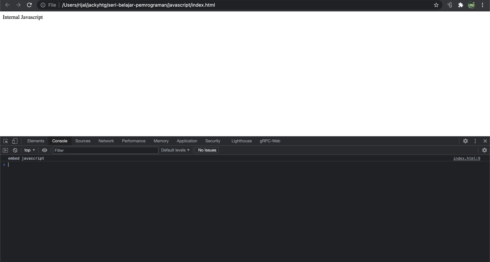

# Pengenalan Javascript

Javascript merupakan bahasa pemrograman yang awalnya hanya bisa berjalan di browser. Namun belakangan, javascript juga bisa jalan di server, sehingga popularitas javascript meningkat dengan drastis. Javascript bisa digunakan untuk membangun frontend web, API backend, frontend mobile, desktop, dan iot.

Untuk tahap awal, kita akan belajar javascript yang berjalan di browser. Ada tiga cara untuk menulis kode javascript di HTML, yaitu : Inline, Embed dan external. 

## Inline 

Kode javascript ditempel langsung pada properti HTML.

```markup
<button onclick="alert('Hi')">Say Hi</button>
```

## Embed

Kode javascript ditulis langsung sebagai tag element &lt;script&gt;&lt;/script&gt; di HTML.

```markup
<!DOCTYPE html>
<html>
  <head>
    <title>Javascript</title>
  </head>
  <body>
    Internal Javascript
    <script>
      console.log("embed javascript");
    </script>
  </body>
</html>
```

Kode di atas akan menampilkan tulisan "Internal Javascript" di browser. Sementara kode javascript akan menampilkan log "embed javascript" di console browser. Untuk melihat console browser, tampilkan developer tools dan klik tab console.



## External

Kode javascript ditulis di file terpisah dan dipanggil melalui link. 




```markup
<!DOCTYPE html>
<html>
  <head>
    <title>Javascript</title>
    <script src="index.js"></script>
  </head>
  <body>
    External Javascript
  </body>
</html>
```





```javascript
console.log("external javascript")
```




