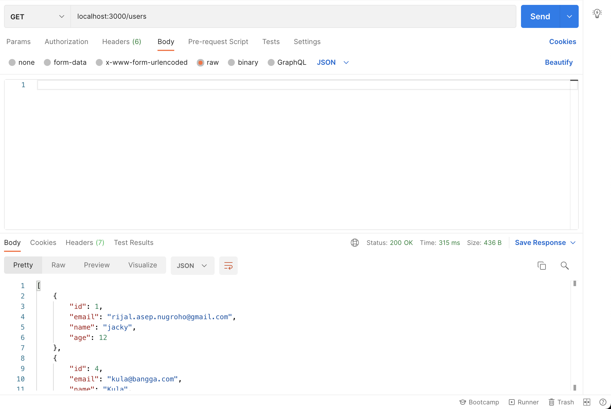
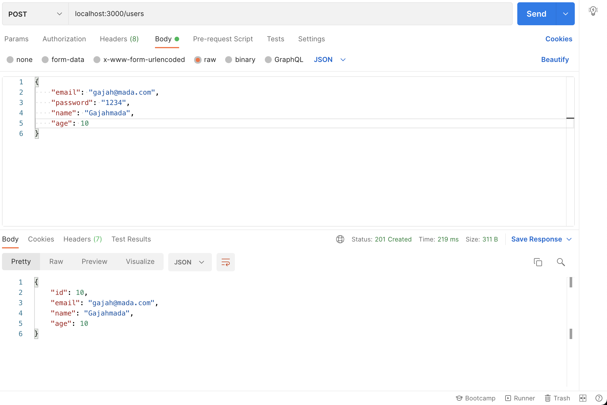
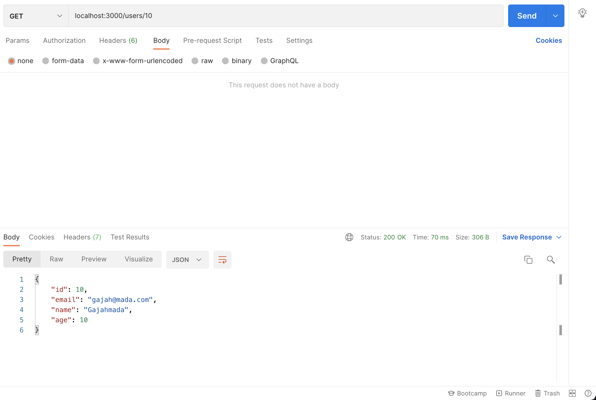
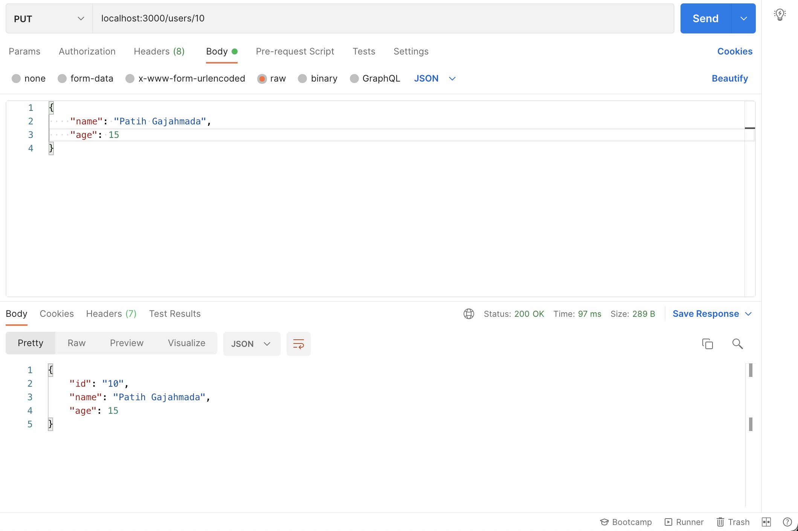
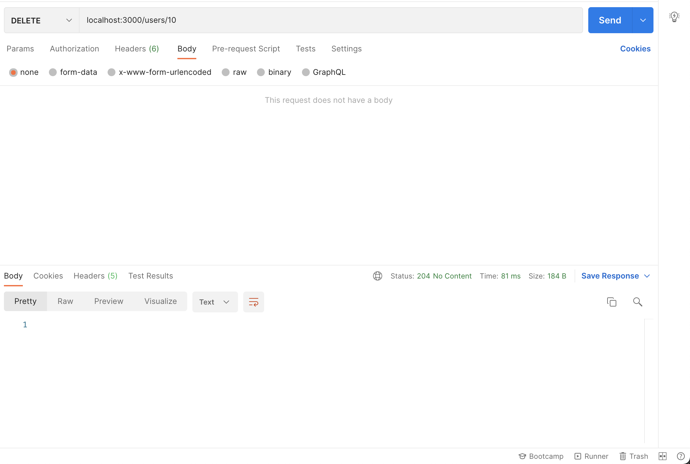

# Rest API

## Rest API

### Method

### Status Code

## Clean Arsitektur

### Routing

### Service

### Model

### Repositories

### Dependency Injection

## Mysql Connection

Buat file helper.config.js

```javascript
module.exports = {
  DB: {
    HOST: "localhost",
    USER: "root",
    PASSWORD: "pass",
    DB: "latihan"
  }
};
```

Buat file helper/mysql.js

```javascript
const mysql = require("mysql");
const DbConfig = require("./config");

// Create a connection to the database
const connection = mysql.createConnection({
  host: DbConfig.DB.HOST,
  user: DbConfig.DB.USER,
  password: DbConfig.DB.PASSWORD,
  database: DbConfig.DB.DB
});

// open the MySQL connection
connection.connect(error => {
  if (error) throw error;
  console.log("Successfully connected to the database.");
});

module.exports = connection;
```

## CRUD

Untuk Rest API, kita akan menyediakan 5 endpoint meliputi Create, Read, Update dan Delete \(CRUD\). Penamaaan dan method endpoint mengikuti konsep best practice Rest API, yaitu :  
- GET /users --&gt; untuk mendapatkan list seluruh users  
- POST /users --&gt; untuk membuat user baru  
- GET /users/:id --&gt; untuk mendapatkan satu user berdasarkan id  
- PUT /users/:id --&gt; untuk mengubah data user berdasarkan id  
- DELETE /users/:id --&gt; untuk menghapus user berdasarkan id  
- POST /login --&gt; untuk login user

Karena menggunakan desain Clean Arsiteksur, maka struktur folder project kita meliputi:

\[domain\]  
---- \[users\]  
      ---- \[repositories\]  
            ---- file-repository.js  
      ----  \[services\]  
            ---- file-service.js  
      ---- model.js  
      ---- route.js  
      ---- service.js  
\[helper\]  
---- file-helper.js  
index.js  
  
file index.js berisi :

```javascript
var express = require('./node_modules/express');
const DB = require('./helper/mysql');
var cors = require('cors');
var app = express();

app.use(cors());
app.use(express.json());

require("./domain/users/route.js")(app, DB);

app.listen(3000);
console.log('Express started on port 3000');
```

file index.js ini simple dan hanya bertugas untuk melakukan pekerjaan middleware berupa :  
- handling cors melalui middleware cors\(\)  
- handling json body parser melalui middleware express.json\(\)  
Untuk installasi cors jalankan `npm install cors`

Selain itu, konkesi database juga dicreate di file index,js yang nantinya akan diteruskan \(diinjeksi\) ke seluruh service yang membutuhkan mengikuti konsep dependency injection.

Routing dilakukan dengan memanggil routing yang ada di setiap domain. 

### GET /users

Buat file domain/users/route.js untuk membuat routing GET /users

```javascript
module.exports = (app, DB) => {
  const users = require("./service.js")(DB);

  app.get("/users", users.List);
};
```

Buat file domain/users/service.js

```javascript
module.exports = db => {
  const List = require("./services/list_user")(db);

  return { List };
};
```

Buat file domain/users/services/list\_user.js

```javascript
module.exports = db => {
  const User = require("../model.js")(db);

  return (req, res) => {
    User.List((err, data) => {
      if (err)
        res.status(500).send({
          message:
            err.message || "Some error occurred while retrieving users."
        });
      else res.send(data);
    });
  };
};
```

Buat file domain/users/model.js

```javascript
module.exports = db => {
  const User = function(user) {
    this.email = user.email;
    this.name = user.name;
    this.password = user.password;
    this.age = user.age;
  };

  User.List = require('./repositories/list_user')(db);

  return User;
};
```

model merupakan entity dari User yang berisi seluruh atribut \(field\) dan method dari User. Dalam hal ini, user mempunyai atribut email, name, password dan age. Sementara method yang disediakan untuk endpoint ini adalah User.List.

Buat file domain/users/repositories/list\_user.js

```javascript
module.exports = db => {
  return result => {
    db.query("SELECT id, email, name, age FROM users", function (err, res) {
      if (err) {
        console.log("error: ", err);
        result(null, err);
        return;
      }

      console.log("users: ", res);
      result(null, res);
    });
  };
};
```

endpoint GET /users sudah bisa dicoba melalui postman



### POST /users

Update file domain/users/route.js untuk menambahkan routing POST /users

```javascript
module.exports = (app, DB) => {
  const users = require("./service.js")(DB);

  app.get("/users", users.List);
  app.post("/users", users.Create);
};
```

Update file domain/users/service.js untuk menambahkan handling service POST /users

```javascript
module.exports = db => {
  const List = require("./services/list_user")(db);
  const Create = require("./services/create_user")(db);

  return { List, Create };
};
```

Update file domain/users/model.js untuk menambahkan method User.Create

```javascript
module.exports = db => {
  const User = function(user) {
    this.email = user.email;
    this.name = user.name;
    this.password = user.password;
    this.age = user.age;
  };

  User.List = require('./repositories/list_user')(db);
  User.Create = require('./repositories/create_user')(db);

  return User;
};
```

Buat file domain/users/services/create\_user.js

```javascript
const bcrypt = require('bcrypt');
const saltRounds = 10;

module.exports = db => {
  const User = require("../model.js")(db);
  return (req, res) => {
    if (!req.body) {
      res.status(400).send({
        message: "Content can not be empty!"
      });
      return 
    }
    
    const user = new User({
      email: req.body.email,
      password: bcrypt.hashSync(req.body.password, saltRounds),
      name: req.body.name,
      age: req.body.age
    });

    User.Create(user, (err, data) => {
      if (err)
        res.status(500).send({
          message:
            err.message || "Some error occurred while create user."
        });
      else res.status(201).send(data);
    });
  };
};
```

Kode di atas membutuhkan bscrypt untuk hasih password. Jangan lupa install bcrypt melalui perintah `npm install bcrypt`. 

Buat file domain/users/repositories/create\_user.js

```javascript
module.exports = db => {
  return (newUser, result) => {
    db.query("INSERT INTO users SET ?", newUser, function (err, res) {
      if (err) {
        console.log("error: ", err);
        result(null, err);
        return;
      }

      delete newUser.password;
      console.log("created user: ", { id: res.insertId, ...newUser });
      result(null, { id: res.insertId, ...newUser });
    });
  };
};
```

Endpoint POST /users sudah bisa dicoba melalui postman



### GET /users/:id

Update file domain/users/route.js untuk menambahkan routing GET /users/:id

```javascript
module.exports = (app, DB) => {
  const users = require("./service.js")(DB);

  app.get("/users", users.List);
  app.post("/users", users.Create);
  app.get("/users/:id", users.View);
};
```

Update file domain/users/service.js untuk menambahkan handling service GET /users/:id

```javascript
module.exports = db => {
  const List = require("./services/list_user")(db);
  const Create = require("./services/create_user")(db);
  const View = require("./services/view_user")(db);

  return { List, Create, View };
};
```

Update file domain/users/model.js untuk menambahkan method User.View

```javascript
module.exports = db => {
  const User = function(user) {
    this.email = user.email;
    this.name = user.name;
    this.password = user.password;
    this.age = user.age;
  };

  User.List = require('./repositories/list_user')(db);
  User.Create = require('./repositories/create_user')(db);
  User.View = require('./repositories/view_user')(db);

  return User;
};
```

Buat file domain/users/services/view\_user.js

```javascript
module.exports = db => {
  const User = require("../model.js")(db);
  
  return (req, res) => {
    const id = req.params.id;
    if (!id) {
      res.status(400).send({
        message: "please suply valid id!"
      });
      return 
    }
    
    User.View(id, (err, data) => {
      if (err)
        res.status(500).send({
          message:
            err.message || "Some error occurred while retrieving user."
        });
      else res.send(data);
    });
  };
}
```

Buat file domain/users/repositories/view\_user.js

```javascript
module.exports = db => {
  return (id, result) => {
    db.query(`SELECT id, email, name, age FROM users WHERE id = ?`, id, (err, res) => {
      if (err) {
        console.log("error: ", err);
        result(err, null);
        return;
      }

      if (res.length) {
        console.log("found user: ", res[0]);
        result(null, res[0]);
        return;
      }

      // not found Customer with the id
      result({ kind: "not_found" }, null);
    });
  };
};
```

Endpoint GET /users/:id sidah bisa dites.



### PUT /users:/id

Update file domain/users/route.js untuk menambahkan routing PUT /users/:id

```javascript
module.exports = (app, DB) => {
  const users = require("./service.js")(DB);

  app.get("/users", users.List);
  app.post("/users", users.Create);
  app.get("/users/:id", users.View);
  app.put("/users/:id", users.Update);
};
```

Update file domain/users/service.js untuk menambahkan handling service PUT /users/:id

```javascript
module.exports = db => {
  const List = require("./services/list_user")(db);
  const Create = require("./services/create_user")(db);
  const View = require("./services/view_user")(db);
  const Update = require("./services/update_user")(db);

  return { List, Create, View, Update };
};
```

Update file domain/users/model.js untuk menambahkan method User.Update

```javascript
module.exports = db => {
  const User = function(user) {
    this.email = user.email;
    this.name = user.name;
    this.password = user.password;
    this.age = user.age;
  };

  User.List = require('./repositories/list_user')(db);
  User.Create = require('./repositories/create_user')(db);
  User.View = require('./repositories/view_user')(db);
  User.Update = require('./repositories/update_user')(db);

  return User;
};
```

Buat file domain/users/services/update\_user.js

```javascript
module.exports = db => {
  const User = require("../model.js")(db);
  
  return (req, res) => {
    if (!req.body) {
      res.status(400).send({
        message: "Content can not be empty!"
      });
      return 
    }

    const id = req.params.id;
    if (!id) {
      res.status(400).send({
        message: "please suply valid id!"
      });
    }
    
    const user = new User({
      name: req.body.name,
      age: req.body.age
    });

    User.Update(id, user, (err, data) => {
      if (err)
        res.status(500).send({
          message:
            err.message || "Some error occurred while update user."
        });
      else res.send(data);
    });
  };
};
```

Buat file domain/users/repositories/update\_user.js

```javascript
module.exports = db => {
  return (id, user, result) => {
    db.query("UPDATE users SET name = ?, age = ? WHERE id = ?", 
      [user.name, user.age, id], 
      function (err, res) {
      if (err) {
        console.log("error: ", err);
        result(null, err);
        return;
      }

      if (res.affectedRows == 0) {
        result({ kind: "not_found" }, null);
        return;
      }

      console.log("update user: ", { id: id, ...user });
      result(null, { id: id, ...user });
    });
  };
};
```

Endpoint PUT /users/:id sidah bisa dites.



### DELETE /users/:id

Update file domain/users/route.js untuk menambahkan routing DELETE /users/:id

```javascript
module.exports = (app, DB) => {
  const users = require("./service.js")(DB);

  app.get("/users", users.List);
  app.post("/users", users.Create);
  app.get("/users/:id", users.View);
  app.put("/users/:id", users.Update);
  app.delete("/users/:id", users.Delete);
};
```

Update file domain/users/service.js untuk menambahkan handling service DELETE /users/:id

```javascript
module.exports = db => {
  const List = require("./services/list_user")(db);
  const Create = require("./services/create_user")(db);
  const View = require("./services/view_user")(db);
  const Update = require("./services/update_user")(db);
  const Delete = require("./services/delete_user")(db);

  return { List, Create, View, Update, Delete };
};
```

Update file domain/users/model.js untuk menambahkan method User.Delete

```javascript
module.exports = db => {
  const User = function(user) {
    this.email = user.email;
    this.name = user.name;
    this.password = user.password;
    this.age = user.age;
  };

  User.List = require('./repositories/list_user')(db);
  User.Create = require('./repositories/create_user')(db);
  User.View = require('./repositories/view_user')(db);
  User.Update = require('./repositories/update_user')(db);
  User.Delete = require('./repositories/delete_user')(db);

  return User;
};
```

Buat file domain/users/services/delete\_user.js

```javascript
module.exports = db => {
  const User = require("../model.js")(db);
  
  return (req, res) => {
    const id = req.params.id;
    if (!id) {
      res.status(400).send({
        message: "please suply valid id!"
      });
      return 
    }
    
    User.Delete(id, (err, data) => {
      if (err)
        res.status(500).send({
          message:
            err.message || "Some error occurred while delete user."
        });
      else res.sendStatus(204);
    });
  };
};
```

Buat file domain/users/repositories/delete\_user.js

```javascript
module.exports = db => {
  return (id, result) => {
    db.query("DELETE FROM users WHERE id = ?", id, (err, res) => {
      if (err) {
        console.log("error: ", err);
        result(null, err);
        return;
      }

      if (res.affectedRows == 0) {
        // not found Customer with the id
        result({ kind: "not_found" }, null);
        return;
      }

      console.log("deleted user with id: ", id);
      result(null, res);
    });
  };
};
```

Endpoint DELETE /users/:id sidah bisa dites.



### Login

Update file domain/users/route.js untuk menambahkan routing POST /login

```javascript
module.exports = (app, DB) => {
  const users = require("./service.js")(DB);

  app.get("/users", users.List);
  app.post("/users", users.Create);
  app.get("/users/:id", users.View);
  app.put("/users/:id", users.Update);
  app.delete("/users/:id", users.Delete);
  app.post("/login", users.Login);
};
```

Update file domain/users/service.js untuk menambahkan handling service login

```javascript
module.exports = db => {
  const List = require("./services/list_user")(db);
  const Create = require("./services/create_user")(db);
  const View = require("./services/view_user")(db);
  const Update = require("./services/update_user")(db);
  const Delete = require("./services/delete_user")(db);
  const Login = require("./services/login")(db);

  return { List, Create, View, Update, Delete, Login };
};
```

Update file domain/users/model.js untuk menambahkan method User.Login

```javascript
module.exports = db => {
  const User = function(user) {
    this.email = user.email;
    this.name = user.name;
    this.password = user.password;
    this.age = user.age;
  };

  User.List = require('./repositories/list_user')(db);
  User.Create = require('./repositories/create_user')(db);
  User.View = require('./repositories/view_user')(db);
  User.Update = require('./repositories/update_user')(db);
  User.Delete = require('./repositories/delete_user')(db);
  User.Login = require('./repositories/login')(db);

  return User;
};
```

Buat file domain/users/services/login.js

```javascript
const bcrypt = require('bcrypt');

module.exports = db => {
  const User = require("../model.js")(db);

  return (req, res) => {
    if (!req.body || !req.body.email || !req.body.password) {
      res.status(400).send({
        message: "invalid email/password!"
      });
      return
    }
    const email = req.body.email;
    const password = req.body.password;
    User.Login(email, (err, data) => {
      if (err) {
        res.status(500).send({
          message:
            err.message || "Some error occurred while login user."
        });
        return 
      }

      if (!bcrypt.compareSync(password, data.password)) {
        res.status(400).send({
          message:
            err.message || "invalid email/password"
        });
        return 
      }
      res.send({token: "alabama-token"});
    });
  };
};
```

Buat file domain/users/repositories/login.js

```javascript
module.exports = db => {
  return (email, result) => {
    db.query(`SELECT password FROM users WHERE email = ?`, email, (err, res) => {
      if (err) {
        console.log("error: ", err);
        result(err, null);
        return;
      }

      if (res.length) {
        result(null, res[0]);
        return;
      }

      // not found Customer with the id
      result({ kind: "not_found" }, null);
    });
  };
};
```

Endpoint POST /login sudah bisa dites.


