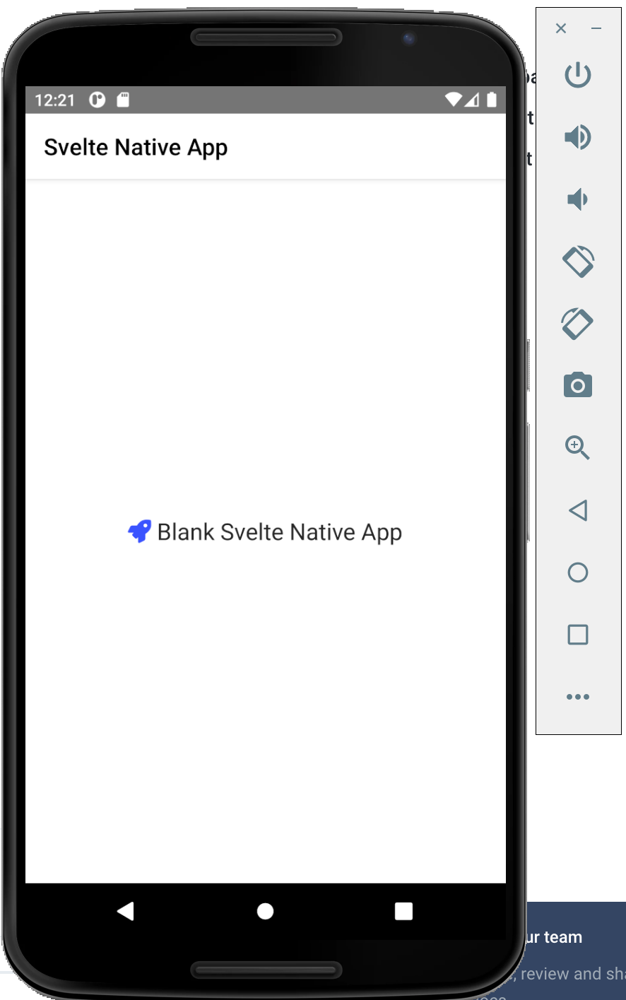

# Pengenalan Svelte Native

Svelte native adalah framework untuk membuat aplikasi mobile, baik android maupun ios.

Persiapan : menginstall android emulator

install java

install android studio

install android emulator

install svelte native

npx degit halfnelson/svelte-native-template myapp

npm install 

ns doctor

ns build android

ns run android

