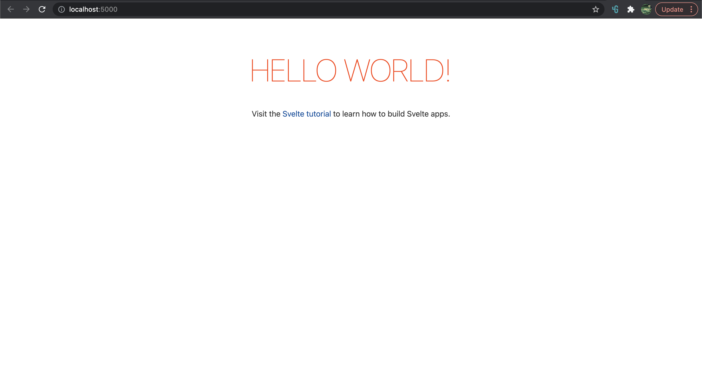

# Pengenalan Svelte

Svelte adalah framework javascript yang modern, cepat dan handal. Keunggulan menggunakan framework utamanya adalah standarisasi kode dan reusable komponen.

### Mengapa Svelte

* Write less code
* No virtual DOM
* Truly reactive

### Installasi

Untuk instalasi dan membuat project, lakukan langkah-langkah berikut:  

* npx degit sveltejs/template nama-project
* npm install
* npm run dev

Sekarang aplikasi sudah bisa dibuka melalui [http://localhost:5000](http://localhost:5000/)



### Struktur Halaman

Struktur halaman svelte sangat sederhana mirip seklai dengan HTML biasa. Terdiri dari tag &lt;script&gt; untuk mengelola kode-kode javascript, tag-tag html biasa, dan dilengkapi dengan tag &lt;style&gt; untuk css.

```markup
<script>
	export let name;
</script>

<main>
	<h1>Hello {name}!</h1>
	<p>Visit the <a href="https://svelte.dev/tutorial">Svelte tutorial</a> to learn how to build Svelte apps.</p>
</main>

<style>
	main {
		text-align: center;
		padding: 1em;
		max-width: 240px;
		margin: 0 auto;
	}

	h1 {
		color: #ff3e00;
		text-transform: uppercase;
		font-size: 4em;
		font-weight: 100;
	}

	@media (min-width: 640px) {
		main {
			max-width: none;
		}
	}
</style>
```

### Prop

prop adalah variabel yang diexport dari external. variabel ini bisa dilempar dari parent saat memanggil komponen, maupun dari url. Pada contoih kode di atas, name adalah sebuah prop, yang ditandai dari kata kunci : export.

Jika kita buka file src/main.js

```javascript
import App from './App.svelte';

const app = new App({
	target: document.body,
	props: {
		name: 'world'
	}
});

export default app;
```

Tampak bahwa ketika memanggil komponen App.Svelte, melempar sebuah props dengan nama "_name_" dan value "_world_".

### State

state adalah suatu variabel yang dibuat di internal dan value-nya bisa berubah-ubah tergangung pada operasi yang berhubungan dengan variabel tersebut. Untuk membuat state cukup dengan membuat variabel seperti biasa dengan kata kunci let maupun const.

Pada contoh kode berikut, selamat adalah sebuah state, yang isinya berubah-ubah tergantung jam. Jika PM akan berisi "_malam_" dan sebaliknya akan berisi "_pagi_". 

```javascript
<script>
	export let name

	let selamat = "pagi"
	
	if (new Date().toLocaleString("en-US", { hour: 'numeric', hour12: true }).split(" ")[1] === "PM") {
    selamat = "malam"
  } 
</script>

<main>
	<h1>Selamat {selamat} {name}!</h1>
	<p>Visit the <a href="https://svelte.dev/tutorial">Svelte tutorial</a> to learn how to build Svelte apps.</p>
</main>

<style>
	main {
		text-align: center;
		padding: 1em;
		max-width: 240px;
		margin: 0 auto;
	}

	h1 {
		color: #ff3e00;
		text-transform: uppercase;
		font-size: 4em;
		font-weight: 100;
	}

	@media (min-width: 640px) {
		main {
			max-width: none;
		}
	}
</style>
```


